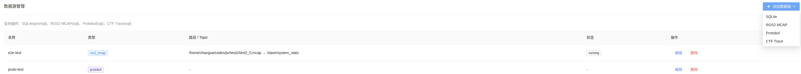
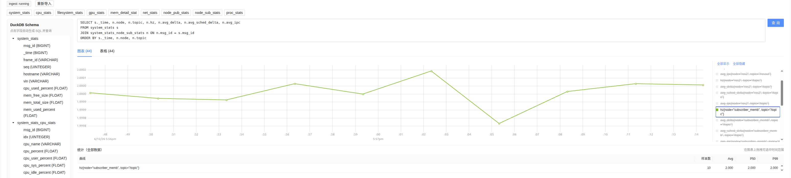

# PulseView

PulseView 是一个轻量级监控性能数据可视化工具。它将 MCAP、Protobuf、CTF、Perfetto 等数据通过可插拔导入器统一写入 DuckDB，再用 SQL 探索，并按查询结果自动展示为时序图、Timeline 泳道图或表格。

SQLite 数据源走 PromQL 查询入口，适合兼容已有时序库。

## 核心能力

- 多格式接入：`ros2_mcap`、`protobuf`、`ctf`、`perfetto`、`sqlite`
- 统一存储：导入型数据源写入每数据源一个 DuckDB 文件
- 自描述 schema：`_pv_table_meta` 保存表结构语义与可视化元数据
- 自动可视化：根据查询结果 `meta` 选择时序图、Timeline 或表格
- 插件化扩展：后端 `FormatImporter`，前端 `PLUGINS` / `VizRegistry`
- ROS2 消息扩展：MCAP 内部通过 `RosMsgAdapter` 展平新消息类型

## 数据源

| plugin_type | 名称 | 输入 | 查询能力 | 默认图表 |
|-------------|------|------|----------|----------|
| `ros2_mcap` | ROS2 MCAP | MCAP 文件 + Topic + Msg 类型 | SQL | 时序图 / 表格 |
| `protobuf` | Protobuf | length-delimited `.pb` + 消息类型 | SQL | 时序图 / 表格 |
| `ctf` | CTF Trace | CTF trace 目录 | SQL | Timeline / 表格 |
| `perfetto` | Perfetto Trace | `.perfetto-trace` / `.pftrace` / Chrome JSON 等 | SQL | Timeline / 表格 |
| `sqlite` | SQLite | SQLite 文件路径 | PromQL | 时序图 |

说明：

- `ros2_mcap` / `protobuf` / `ctf` / `perfetto` 会导入 DuckDB。
- `ctf` 支持内置最小 CTF 与真实 LTTng / `ros2 trace`。真实 LTTng 读取需 `bt2`。
- `perfetto` 依赖 Perfetto Trace Processor，详见 [docs/support_perfetto.md](docs/support_perfetto.md)。

## 图表类型

| viz type | 适用条件 | 说明 |
|----------|----------|------|
| `timeseries` | 有 `time_column` 和 `value_columns` | uPlot 多线时序图，带统计表 |
| `timeline` | 有 `time_column` 和 `dur_column` | Canvas 泳道图，支持框选缩放与 hover |
| `table` | 任意查询结果 | 原始结果表 |

## 快速预览

#### 设置数据源



#### 查看监控指标



## 目录结构

```text
PulseView/
├── backend/     FastAPI + DuckDB + 格式导入器
├── fronted/     React + Vite + Ant Design + 图表可视化
├── monitors/    ROS/C++ 系统指标采集与消息定义
├── docs/        架构、设计与扩展文档
└── e2e/         Playwright 端到端测试
```

## 快速启动

### 1. 启动后端

```bash
cd backend
python3 -m venv .venv
.venv/bin/pip install -r requirements.txt
.venv/bin/python run.py
```

后端默认监听：`http://0.0.0.0:8080`

可选依赖：

- 真实 LTTng / `ros2 trace` CTF：安装 `babeltrace2 python3-bt2`，并用 `--system-site-packages` 创建 venv。
- Perfetto：安装 `perfetto` Python 包，并保证 `trace_processor_shell` 可用。

### 2. 启动前端

```bash
cd fronted
npm install
npm run dev
```

前端默认监听：`http://localhost:8766`，并代理 `/api` 到后端 `:8080`。

无后端时可启用 mock：

```bash
cd fronted
USE_MOCK=true npm run dev
```

## 使用流程

1. 启动后端和前端。
2. 进入“数据源管理”，添加数据源：
   - ROS2 MCAP：填写 MCAP 路径、Topic、Msg 类型。
   - Protobuf：填写 `.pb` 路径，扫描并选择消息类型。
   - CTF Trace：填写 trace 目录并扫描。
   - Perfetto Trace：填写 trace 文件并扫描。
   - SQLite：填写 SQLite 文件路径。
3. 保存后，具备 `ingest` 能力的数据源会自动导入 DuckDB。
4. 进入“数据探索”，选择数据源：
   - DuckDB 类数据源：查看 Schema、点击字段生成 SQL、或使用预设查询。
   - SQLite：输入 PromQL 查询。
5. 查询结果会自动选择图表：时序数据用折线图，span 数据用 Timeline，其它结果用表格。

## 主要 API

| 接口 | 说明 |
|------|------|
| `GET /api/datasource/plugins` | 列出数据源插件及能力 |
| `GET /api/datasources` | 列出数据源 |
| `POST /api/datasources` | 创建数据源，必要时自动导入 |
| `PUT /api/datasources/{id}` | 更新数据源 |
| `DELETE /api/datasources/{id}` | 删除数据源与 DuckDB 文件 |
| `GET /api/inspect?plugin_type=&path=` | 扫描原始文件或 trace |
| `POST /api/datasources/{id}/ingest` | 手动重新导入 |
| `GET /api/datasources/{id}/schema` | 返回 DuckDB schema 与可视化元数据 |
| `POST /api/sql/query` | 执行 SELECT SQL |
| `POST /api/query_range` | PromQL 范围查询 |

数据默认保存在 `backend/data/`：

- `datasources.json`：数据源配置与导入状态
- `duckdb/{id}.duckdb`：每个数据源对应的 DuckDB 文件

## 架构与扩展

推荐先看：
注：需要安装 draw.io插件查阅
- [docs/pulseview_architecture.drawio](docs/pulseview_architecture.drawio)：draw.io 架构图
- [docs/architecture.md](docs/architecture.md)：类图与端到端流程图
- [docs/design.md](docs/design.md)：多格式扩展设计
- [docs/add_new_format.md](docs/add_new_format.md)：新增数据格式
- [docs/add_new_ros2_msg.md](docs/add_new_ros2_msg.md)：新增 ROS2 消息类型
- [docs/ros2_tracing.md](docs/ros2_tracing.md)：LTTng / ros2_tracing
- [docs/support_perfetto.md](docs/support_perfetto.md)：Perfetto Trace 支持

### 新增数据格式

最小改动：

1. 实现 `backend/app/ingest/importers/your_importer.py`。
2. 实现 `FormatImporter`：`format_type`、`required_settings()`、`inspect()`、`ingest()`。
3. 用 `TableDef` 声明表结构，并调用 `write_table_meta()`。
4. 在 `backend/app/ingest/importers/__init__.py` import 以触发注册。
5. 在 `backend/app/store.py` 的 `PLUGIN_META` 增加能力声明。
6. 在 `fronted/src/plugins/<type>/` 增加表单和查询面板，并注册到 `PLUGINS`。

### 新增 ROS2 消息类型

最小改动：

1. 在 `backend/app/ingest/adapters/` 新增 Adapter。
2. 实现 `RosMsgAdapter`：`msg_type`、`tables()`、`flatten()`。
3. 调用 `registry.register(YourAdapter())`。
4. 在 `backend/app/ingest/adapters/__init__.py` import 以触发注册。

前端通常无需改动：只要表包含 `_time`、维度列和数值列，现有图表即可复用。

## 测试

### 测试样本

样本默认放在仓库同级目录 `../test2/`，可通过环境变量覆盖：

| 格式 | 默认样本 | 生成方式 | 环境变量 |
|------|----------|----------|----------|
| MCAP | `../test2/test2_0.mcap` | 外部提供 | `PULSEVIEW_TEST_MCAP` |
| Protobuf | `../test2/proto_sample.pb` | `python backend/scripts/gen_proto_sample.py` | `PULSEVIEW_TEST_PROTO` |
| CTF（内置最小） | `../test2/ctf_sample/` | `python backend/scripts/gen_ctf_sample.py` | `PULSEVIEW_TEST_CTF` |
| CTF（真实 LTTng） | `samples/ros2_trace_demo/traces/pv_trace_demo/` | `samples/ros2_trace_demo/record_and_verify.sh`（需 ROS 2 Jazzy + lttng-tools） | — |
| Perfetto | `../test2/perfetto_sample.json` | `python backend/scripts/gen_perfetto_sample.py` | `PULSEVIEW_TEST_PERFETTO` |

### 后端测试

```bash
cd backend
python3 -m venv .venv
.venv/bin/pip install -r requirements.txt -r requirements-dev.txt
.venv/bin/python -m pytest tests -q
```

覆盖范围：

- `FormatImporter` 注册与导入
- `RosMsgAdapter` flatten
- DuckDB schema 与 SQL 查询
- `_pv_table_meta` 元数据
- CTF / Protobuf / Perfetto 相关导入逻辑

### E2E 测试

```bash
npm install
npx playwright install chromium
npm run test:e2e
```

E2E 覆盖：

- 数据源列表与页面导航
- 后端 API 基本流程
- Schema 预设查询与 SQL 查询
- 时序图、统计表、表格切换
- CTF span 数据的 Timeline 渲染

