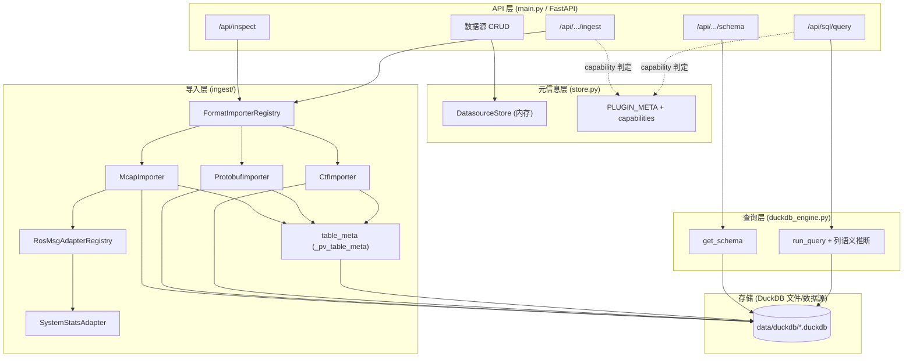
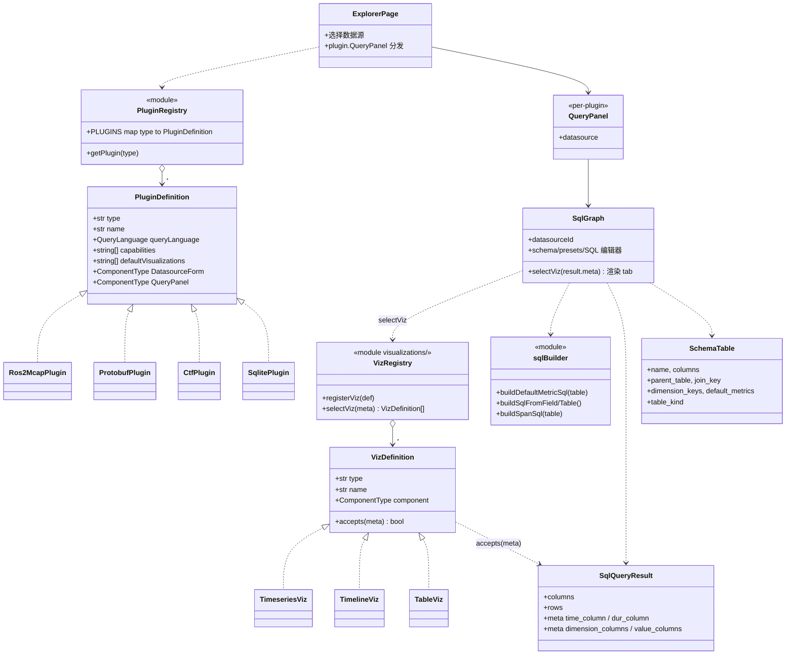
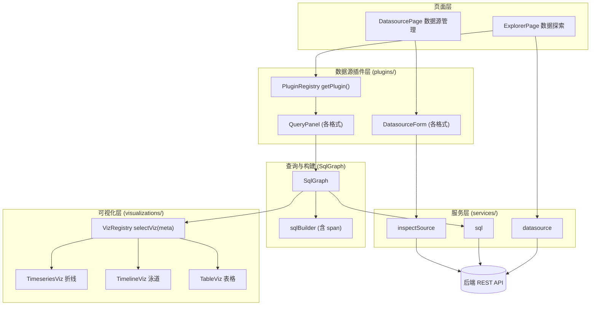
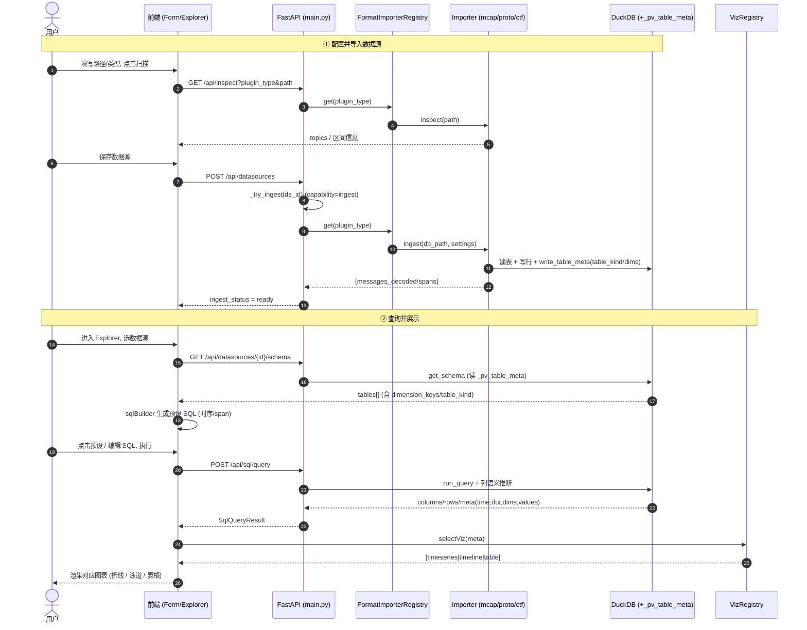
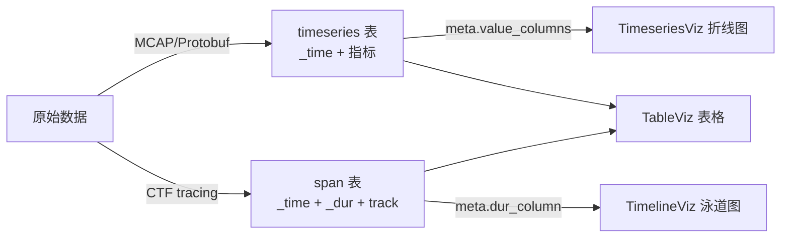

# PulseView 架构图

本文档汇总当前（阶段 0–4 完成后）前后端的**类图**、**架构图**与**端到端流程图**。
所有图使用 Mermaid 绘制，可在支持 Mermaid 的 Markdown 预览中查看。

- 后端：FastAPI + DuckDB，两级可扩展（格式级 `FormatImporter` + 消息级 `RosMsgAdapter`）
- 前端：React + Antd，插件注册表（`PluginDefinition`）+ 图表注册表（`VizDefinition`）
- 中间契约：DuckDB 表 + `_pv_table_meta` 元数据 + 统一查询结果 `meta`

---

## 一、后端类图

```mermaid
classDiagram
    %% ====== 格式级：FormatImporter ======
    class FormatImporter {
        <<Protocol>>
        +str format_type
        +required_settings() list~str~
        +inspect(path) dict
        +ingest(db_path, settings) dict
    }
    class FormatImporterRegistry {
        -dict _importers
        +register(importer)
        +get(format_type) FormatImporter
        +has(format_type) bool
        +list_formats() list
    }
    class McapImporter {
        +format_type = "ros2_mcap"
        +ingest() 使用 ingest_mcap + RosMsgAdapter
    }
    class ProtobufImporter {
        +format_type = "protobuf"
        +ingest() 使用 proto_schema
    }
    class CtfImporter {
        +format_type = "ctf"
        +ingest() 使用 ctf_format, 配对 span
    }
    FormatImporter <|.. McapImporter
    FormatImporter <|.. ProtobufImporter
    FormatImporter <|.. CtfImporter
    FormatImporterRegistry o--> "*" FormatImporter

    %% ====== 消息级：RosMsgAdapter（MCAP 内部二级注册表）======
    class RosMsgAdapter {
        <<Protocol>>
        +str msg_type
        +tables() list~TableDef~
        +flatten(msg, ctx) dict
    }
    class RosMsgAdapterRegistry {
        -dict _adapters
        +register(adapter)
        +get(msg_type) RosMsgAdapter
        +list_msg_types() list
    }
    class SystemStatsAdapter {
        +msg_type = ".../SystemStats"
    }
    RosMsgAdapter <|.. SystemStatsAdapter
    RosMsgAdapterRegistry o--> "*" RosMsgAdapter
    McapImporter ..> RosMsgAdapterRegistry : 解码用

    %% ====== 表结构与元数据 ======
    class TableDef {
        +str name
        +list~ColumnDef~ columns
        +str parent_table
        +str join_key
        +list dimension_keys
        +list default_metrics
        +str table_kind
    }
    class ColumnDef {
        +str name
        +str duckdb_type
    }
    class IngestContext {
        +int msg_id
        +int time_us
    }
    TableDef o--> "*" ColumnDef
    RosMsgAdapter ..> TableDef
    ProtobufImporter ..> TableDef
    CtfImporter ..> TableDef

    %% ====== 持久化 / 查询引擎 ======
    class table_meta {
        <<module>>
        +META_TABLE = "_pv_table_meta"
        +write_table_meta(conn, tables)
        +read_table_meta(conn) dict
    }
    class duckdb_engine {
        <<module>>
        +get_schema(db_path) dict
        +run_query(db_path, sql) dict
        +_infer_columns() time/dur/dims/values
    }
    class DatasourceStore {
        +list/create/update/delete
        +PLUGIN_META
        +plugin_capabilities(type)
    }
    table_meta ..> TableDef
    duckdb_engine ..> table_meta : 读元数据
    ProtobufImporter ..> table_meta : 写元数据
    CtfImporter ..> table_meta
    McapImporter ..> table_meta

    %% ====== API 层 ======
    class FastAPI_main {
        <<module>>
        +/api/datasources CRUD
        +/api/inspect
        +/api/datasources/{id}/ingest
        +/api/datasources/{id}/schema
        +/api/sql/query
        +_try_ingest(ds_id)
    }
    FastAPI_main ..> FormatImporterRegistry : 分派 ingest/inspect
    FastAPI_main ..> duckdb_engine : schema/query
    FastAPI_main ..> DatasourceStore : 元信息
```

---

## 二、后端分层架构图



---

## 三、前端类/组件图



---

## 四、前端分层架构图



---

## 五、端到端流程图（建源 → 导入 → 查询 → 可视化）



---

## 六、数据形态 → 默认可视化对照



> 关键解耦点：可视化的选择只依赖**查询结果 `meta`**（是否有 `value_columns` / `dur_column`），
> 与数据来自哪种格式无关；新增格式只要落成对应 `table_kind` 的表即可自动复用图表。
