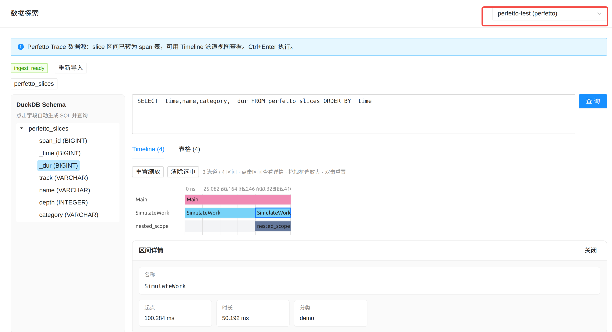

# Perfetto Trace 数据源

通过 Perfetto Trace Processor 解析 trace 文件，将 slice 导入 DuckDB span 表，用 **Timeline 泳道图** 查看。

#### 效果预览



## 适用场景

- C++/Android/Linux 等 Perfetto SDK 输出的 trace
- Chrome JSON trace、systrace 等 Trace Processor 支持的格式

支持扩展名示例：`.perfetto-trace`、`.pftrace`、Chrome JSON 等（由 Trace Processor 自动识别）。

## 前置条件

两项依赖缺一不可：

| 依赖 | 安装 |
|------|------|
| Python 包 `perfetto` | `cd backend && .venv/bin/pip install -r requirements.txt` |
| 二进制 `trace_processor_shell` | `which trace_processor_shell`，或下载后设置 `PULSEVIEW_TP_SHELL` |

```bash
# 下载 shell（示例）
curl -LO https://get.perfetto.dev/trace_processor
chmod +x trace_processor
export PULSEVIEW_TP_SHELL=$PWD/trace_processor

# 诊断（须用 venv 的 Python）
cd backend
.venv/bin/python -c "
from app.ingest import perfetto_tp
print(perfetto_tp.missing_dependency() or 'OK')
print('shell:', perfetto_tp.shell_path())
"
```

启动后端时建议使用 venv，并导出环境变量：

```bash
source .venv/bin/activate
export PULSEVIEW_TP_SHELL=/usr/local/bin/trace_processor_shell  # 按实际路径
python run.py
# 启动日志应显示: [pulseview] perfetto: ready (shell=...)
```

## 添加数据源

1. **数据源管理** → **新增** → **Perfetto Trace**
2. 填写 **Perfetto trace 文件** 绝对路径，点击 **扫描**
3. 确认泳道列表，**保存并导入 DuckDB**

### 配置项

| settings 键 | 说明 |
|-------------|------|
| `perfetto.path` | trace 文件绝对路径 |

## 数据探索

导入后写入 `perfetto_slices` 表，示例 SQL：

```sql
SELECT _time, _dur, track, name, depth FROM perfetto_slices ORDER BY _time;
```

含 `_time`、`_dur` 时自动渲染 **Timeline**。

## 生成示例 trace

仓库自带 C++ 示例：

```bash
cd examples/perfetto
./fetch_sdk.sh
cmake -B build -DCMAKE_BUILD_TYPE=Release && cmake --build build -j
./build/pulseview_perfetto_example
# 生成 pulseview_example.pftrace
```

将该文件路径填入数据源即可。

也可生成 JSON 测试样本：

```bash
cd backend
.venv/bin/python scripts/gen_perfetto_sample.py
```

## 故障排查

| 现象 | 处理 |
|------|------|
| 「依赖未就绪」 | 确认 venv 内已装 `perfetto` 包，且 `trace_processor_shell` 可执行 |
| 用系统 `python3 run.py` 报错 | 改用 `.venv/bin/python run.py` |
| UI 仍显示旧错误 | 依赖修好后点 **重新 ingest**，不必重装 PulseView |
| 扫描 0 个区间 | 确认 trace 含 `dur > 0` 的 slice |

设计与实现细节见 [support_perfetto.md](../support_perfetto.md)；写入侧原理见 [tracers/perfetto.md](../tracers/perfetto.md)。
