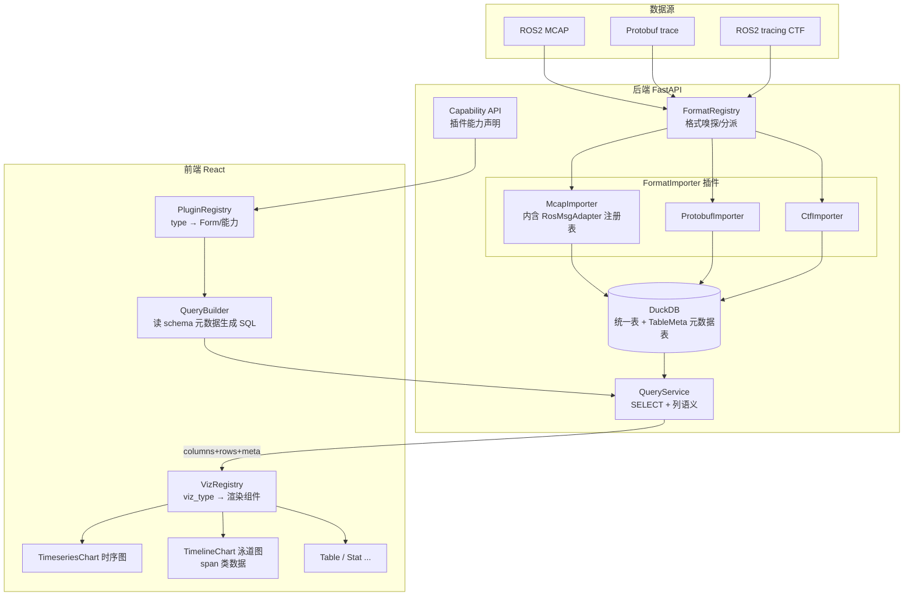

# PulseView 架构分析与多格式扩展设计

> 目标：在现有「ROS2 MCAP → DuckDB → SQL 可视化」架构基础上，扩展支持多种监控性能数据格式（Protobuf、ROS2 tracing CTF 等），并支持按数据类型展示不同图表（时序图、timeline 泳道图等）。
>
> 参考项目：[nightingale 前端](https://github.com/ccfos/nightingale)（`fe/`，数据源插件化与图表解耦）、[Perfetto](https://perfetto.dev)（`perfetto/`，多格式统一导入与 timeline 体系）。

---

## 一、PulseView 现状架构

### 1.1 当前数据流

```
MCAP 文件 → mcap_ros2 解码 → RosMsgAdapter.flatten() → DuckDB（每数据源一个 .duckdb）
         → GET /schema（表结构 + dimension_keys/default_metrics 元数据）
         → POST /sql/query（SELECT + 列语义推断）
         → 前端 SqlGraph → rowsToSeries 分线 → uPlot TimeseriesChart
```

**做得好的部分**（后续扩展的基石）：

- 后端 `RosMsgAdapter` Protocol + `registry` 注册表，新增 ROS msg 类型只需写一个 Adapter（`backend/app/ingest/registry.py`）
- `TableDef` 携带可视化元数据（`parent_table`、`dimension_keys`、`default_metrics`），通过 Schema API 驱动前端自动分线——这是 Perfetto「数据自描述」思想的雏形
- 图表层 `TimeseriesChart` + `utils/timeseries.ts` 只消费「时间列 + 维度列 + 数值列」，与数据源无关
- 前端 `plugins/index.ts` 已有 `PluginDefinition`（type → Form + queryLanguage）的注册表雏形

### 1.2 阻碍扩展新格式的核心耦合点

| 层 | 耦合 | 位置 |
|---|---|---|
| 数据源模型 | `plugin_type: Literal["sqlite", "ros2_mcap"]` 枚举写死 | `backend/app/models.py`、`fronted/src/types/index.ts` |
| API 门禁 | `ingest`/`schema`/`sql/query` 全部 `if plugin_type != "ros2_mcap"` 拒绝 | `backend/app/main.py` |
| Ingest 管线 | 只有 `ingest_mcap` 一条管线，时间戳提取写死 ROS `header.stamp`，settings 键写死 `mcap.*` | `backend/app/ingest/pipeline.py`、`main.py _try_ingest` |
| 列语义推断 | `KNOWN_DIMENSION_COLUMNS` 白名单硬编码列名 | `backend/app/duckdb_engine.py` |
| 前端 SQL 生成 | `MAIN_TABLE = 'system_stats'` 写死，未消费 schema 已返回的 `parent_table`/`join_key` | `fronted/src/components/SqlGraph/sqlBuilder.ts` |
| 前端展示分发 | Explorer 只有 promql/sql 二分支，无按数据类型选择图表的机制 | `fronted/src/pages/explorer/index.tsx` |

---

## 二、参考项目的关键启示

### 2.1 fe（夜莺前端）—— 数据源插件化与图表解耦

最值得借鉴：**查询与渲染彻底分离**。所有数据源适配器（prometheus/ES/TDengine/ClickHouse…）统一输出 `series[]` 契约（`{name, metric: labels, data: [ts, value][]}`），12 种图表（timeseries/stat/table/pie/heatmap…）只消费 `series[]`。新增数据源不动图表，新增图表不动数据源。

- 分发枢纽：`fe/src/pages/dashboard/Renderer/datasource/useQuery.tsx` 的 `fetchQueryMap` + `Renderer/Main.tsx` 的 `RendererCptMap`
- **约定式插件目录**：`src/plugins/{cate}/` 下固定子目录（`Datasource/Form`、`Dashboard/QueryBuilder`、`Dashboard/datasource`、`Explorer/`），按集成点拆分导出
- **能力元数据驱动 UI**：`baseCates`（`src/components/AdvancedWrap/utils.ts`）用 `dashboard: true`、`alertRule: true` 等布尔标记控制 UI 显隐，避免到处 `if (cate === 'xxx')`
- **教训**：fe 没有统一 Registry，每加一个数据源要改 5~8 个 Hub 文件。PulseView 应收敛为单一注册点

### 2.2 perfetto —— 多格式统一与 timeline 体系

1. **「一切皆 SQL 表」中间层**：20+ 种 trace 格式（proto、systrace/CTF、json、perf…）全部 ETL 到统一列式表（`slice`、`track`、`counter`、`sched`），UI 和分析只跟 SQL 交互。**PulseView 已选 DuckDB，天然适合复制这条路线**——这是整个设计中最重要的决策
2. **两级 Importer 注册**：格式级 `TraceReaderRegistry`（TraceType → ChunkedTraceReader 工厂）+ 字段级 `ProtoImporterModule`；入口 `ForwardingTraceParser` 自动嗅探格式分派。统一三阶段协议：`Parse(chunk) → Sort → Finalize`
3. **Plugin + Track 双注册**：UI 插件 `onTraceLoad(ctx)` 中查 SQL 决定建哪些 track，`ctx.tracks.registerTrack({uri, renderer})`，再挂到 Workspace 树。timeline 核心不感知业务
4. **视口感知查询**：track 渲染按 `visibleWindow + resolution` 生成 time-bucket（mipmap）SQL，只拉可见窗口数据。这是支持大数据量 timeline 的关键

关键代码位置：`src/trace_processor/trace_reader_registry.h`、`importers/common/chunked_trace_reader.h`、`ui/src/public/plugin.ts`、`ui/src/public/track.ts`、`ui/src/components/tracks/slice_track.ts`。

---

## 三、目标架构设计

### 3.1 核心思想

> **DuckDB 作为统一中间层（perfetto 思路）+ 前后端双注册表插件体系（fe 思路改良）+ 图表与数据源通过「列语义契约」解耦。**

任何新格式（protobuf、CTF、MCAP、未来的 perf 数据）的支持工作收敛为两件事：

- 后端写一个 **FormatImporter**（怎么进 DuckDB）
- 前端声明 **能用哪些 Visualization**（已有图表直接复用，特殊形态如 timeline 才写新的）

### 3.2 架构图



### 3.3 关键抽象设计

#### 后端

**① FormatImporter 协议 + FormatRegistry —— 策略模式 + 注册表模式 + 工厂方法**

把现有 `RosMsgAdapter` 上提一层，新增「格式级」抽象（对应 perfetto 的 `ChunkedTraceReader` + `TraceReaderRegistry`）：

```python
class FormatImporter(Protocol):
    format_type: str                 # "ros2_mcap" / "protobuf" / "ctf"
    settings_schema: dict            # 该格式需要哪些 settings 键（替代写死 mcap.*）

    def sniff(self, path: Path) -> bool: ...                    # 格式嗅探（魔数/扩展名）
    def inspect(self, path: Path) -> dict: ...                  # 替代 mcap_inspect，返回 topic/channel 列表
    def ingest(self, db_path: Path, settings: dict) -> IngestReport: ...
    def capabilities(self) -> set[str]: ...                     # {"sql", "inspect", "timeline"}
```

- `main.py` 的 `_try_ingest`、`/inspect`、各处 `if plugin_type != "ros2_mcap"` 门禁全部改为 `format_registry.get(plugin_type)` 分派 + 按 `capabilities()` 判断
- 现有 `RosMsgAdapter` registry 降级为 **McapImporter 内部的二级注册表**（对应 perfetto 的 `ProtoImporterModule` 两级结构），CTF Importer 内部同样可有自己的 event 级 adapter
- 时间戳提取从全局函数变为各 Importer/Adapter 自己的职责

**② 统一表语义约定 + 元数据落库 —— 数据自描述**

当前 `dimension_keys` 等元数据靠运行时从 Adapter 取（依赖 settings 里的 msg_type），改为 **ingest 时写入 DuckDB 内置元数据表**：

```
_pv_table_meta(table_name, table_kind, parent_table, join_key,
               dimension_keys, default_metrics, time_column)
```

- `table_kind` 区分数据形态：`timeseries`（现有指标）/ `span`（有 `_time + _dur` 的区间数据，CTF tracing 用）/ `log`
- Schema API 直接读这张表，与「是什么格式导入的」彻底解耦；`KNOWN_DIMENSION_COLUMNS` 启发式只作兜底
- 这是前端选择图表类型的依据：`span` 表 → timeline 视图，`timeseries` 表 → 折线图

**③ 时间与关联约定**

全局统一：时间列 `_time`（微秒 BIGINT）、span 类增加 `_dur`（微秒）、关联键沿用 `msg_id`/`span_id`。所有 Importer 负责把各自格式的时间归一化到这个约定。

#### 前端

**④ PluginRegistry 收敛 —— 注册表模式（吸取 fe 的教训）**

扩展现有 `plugins/index.ts` 的 `PluginDefinition`，一个插件一次注册声明全部集成点，杜绝 fe 那种「改 8 个 Hub 文件」：

```typescript
interface PluginDefinition {
  type: string;
  name: string;
  DatasourceForm: ComponentType<FormProps>;     // 已有
  QueryPanel: ComponentType<QueryPanelProps>;   // 替代 explorer 里的 promql/sql 二分支
  capabilities: string[];                       // 与后端 Capability API 对齐
  defaultVisualizations: string[];              // 该格式默认图表类型
}
```

**⑤ VizRegistry + 统一数据契约 —— 策略模式（借鉴 fe 的 series[] 解耦）**

图表注册表 `viz_type → { component, accepts }`，所有图表消费统一查询结果契约（现有 `/sql/query` 返回结构的扩展）：

```typescript
interface QueryResultMeta {
  table_kind: 'timeseries' | 'span' | 'log';
  time_column: string; dur_column?: string;
  dimension_columns: string[]; value_columns: string[];
}
```

- 现有 `TimeseriesChart`、表格直接成为 VizRegistry 的前两个成员
- 新增 **TimelineChart**（泳道图）消费 `span` 类结果：每个 dimension 组合一条泳道，`[_time, _time+_dur]` 画区间块。第一版用 canvas + 可见窗口过滤即可，数据量大后再引入 perfetto 式 time-bucket 聚合 SQL（视口感知查询）
- 选择逻辑：`meta.table_kind` + 插件 `defaultVisualizations` → 自动选图，用户可手动切换

**⑥ sqlBuilder 元数据驱动改造**

删掉 `MAIN_TABLE = 'system_stats'`，全部 JOIN/别名从 schema 返回的 `parent_table`/`join_key` 生成。这一步不依赖任何新功能，是纯还债，应最先做。

### 3.4 设计模式小结

| 模式 | 应用点 |
|---|---|
| **注册表（Registry）** | 后端 FormatRegistry、Adapter 二级注册表；前端 PluginRegistry、VizRegistry |
| **策略（Strategy）** | FormatImporter 各格式实现；前端各 Visualization 渲染策略 |
| **模板方法（Template Method）** | ingest 管线骨架（建表→清表→迭代→批量插入→落元数据）固定，各 Importer 只实现解码与展平 |
| **适配器（Adapter）** | RosMsgAdapter / 未来的 ProtoMsgAdapter、CtfEventAdapter，把各格式消息适配为统一行数据 |
| **门面（Facade）** | QueryService 统一封装 DuckDB 查询 + 列语义推断，前端只面对一个查询 API |
| **能力声明（Capability，借鉴 fe）** | 后端插件声明 capabilities，前端按能力显隐 UI，替代字符串比较门禁 |

刻意**不引入**的：抽象工厂层级、动态插件加载（Python entry_points / 前端远程模块）——当前规模下约定式静态注册足够。

---

## 四、实施计划

### 阶段 0：还债与解耦（不加新功能，约 1 周）✅ 已完成

1. ✅ 前端 `sqlBuilder.ts` 改为消费 `parent_table`/`join_key`，删除 `MAIN_TABLE`；预设查询改由 `default_metrics` 元数据生成
2. ✅ 后端去掉 `plugin_type` Literal 枚举，`PLUGIN_META` 增加 `capabilities`；API 门禁改为 capability 判断
3. ✅ 现有 e2e 测试全量回归（后端单测 6/6、e2e 12/12 通过）

### 阶段 1：后端 FormatImporter 框架 ✅ 已完成

4. ✅ 定义 `FormatImporter` Protocol + `FormatImporterRegistry`（`app/ingest/importer.py`），现有 MCAP 逻辑封装为 `McapImporter`（`app/ingest/importers/mcap_importer.py`），行为保持不变；`RosMsgAdapter` registry 降为消息级二级注册表
5. ✅ 新增 `_pv_table_meta` 元数据表（`app/ingest/table_meta.py`），`TableDef` 增加 `table_kind`，ingest 时落库；`get_schema` 优先读该表（旧库回退 Adapter），排除元数据表
6. ✅ 新增通用 `GET /api/inspect?plugin_type=&path=`（`/api/mcap/inspect` 保留为兼容别名），`_try_ingest` 改为 `format_registry` 分派 + `required_settings` 校验
7. ✅ 补充单测（`test_table_meta.py`，后端 9/9、e2e 12/12 通过）

### 阶段 2：前端插件与图表注册表 ✅ 已完成

8. ✅ 扩展 `PluginDefinition`（新增 `QueryPanel`、`capabilities`、`defaultVisualizations`）+ `QueryPanelProps`；为 sqlite/ros2_mcap 各加 `QueryPanel` 包装组件；Explorer 改为 `plugin.QueryPanel` 分发，删除 promql/sql 二分支硬编码
9. ✅ 新建 `src/visualizations/` VizRegistry（`registry.ts` + `TimeseriesViz`/`TableViz`），每种图表声明 `accepts(meta)`；`SqlGraph` 用 `selectViz(result.meta)` 动态渲染 tab，删除 `SqlResultTable`（并入 `TableViz`）
10. ✅ 前端类型检查通过，e2e 12/12 全过（图表/数据源解耦后行为不变）

### 阶段 3：第一个新格式落地验证 ✅ 已完成

9. ✅ 实现 **ProtobufImporter**（`app/ingest/importers/proto_importer.py`）：length-delimited `pulseview.MetricSample` 消息流 → 展平 → DuckDB，复用同一套 `TableDef` / `_pv_table_meta` / 列语义推断，前端时序图表零改动；schema 用动态描述符运行时构建（`app/ingest/proto_schema.py`，不依赖 protoc）
10. ✅ 测试数据生成器 `backend/scripts/gen_proto_sample.py`，产出 `../test2/proto_sample.pb`（120 样本 × 4 核）
11. ✅ 前端新增 `protobuf` 插件（`Form` 带文件扫描 + `QueryPanel` 复用 `SqlGraph`），`PLUGIN_META` 注册 `protobuf` 能力 `[ingest, schema, sql]`
12. ✅ 补 `docs/add_new_format.md`（格式级扩展指南）
13. ✅ 后端单测 12/12（含 `test_proto_importer.py` 3 项）、e2e backend-api 7/7 通过（protobuf 端到端：建源→ingest→schema→SQL 查询）

### 阶段 4：CTF + Timeline 视图 ✅ 已完成

11. ✅ **CtfImporter**（`app/ingest/importers/ctf_importer.py`）：解析 CTF stream → 按 tid 栈配对 `callback_start/end` 为区间 → 写入 `span` 类表 `ctf_spans`（`_time`、`_dur`、`track`、`name`、`cpu_id`），`table_kind=span`、`dimension_keys=["track"]`。环境无 babeltrace2/lttng，故内置最小自包含 CTF 1.8 读写（`app/ingest/ctf_format.py`，metadata TSDL + 二进制 stream，生产可替换为 babeltrace2）
12. ✅ 测试 trace 生成器 `backend/scripts/gen_ctf_sample.py`，产出 `../test2/ctf_sample/`（4 线程 × 30 回调 = 120 spans）
13. ✅ 后端列语义新增 `dur_column` 检测（`_dur`），`run_query` meta 透出
14. ✅ 前端 **TimelineViz**（`src/visualizations/TimelineViz.tsx`）：canvas 泳道渲染 + 拖拽框选缩放 + 双击重置 + hover tooltip + 按 name 着色；注册到 VizRegistry，`accepts = time_column && dur_column`
15. ✅ `sqlBuilder` 增加 span 预设（`SELECT _time, _dur, <dims>, name`）；新增前端 `ctf` 插件（Form 扫描 + QueryPanel 复用 SqlGraph），`PLUGIN_META` 注册 `ctf` 能力
16. ✅ 后端单测 15/15（含 `test_ctf_importer.py` 3 项）、e2e 15/15（含 ctf backend-api + timeline-ui 泳道渲染）通过

### 阶段 5（可选，按需）

13. 大文件流式 ingest（perfetto 三阶段 Parse/Sort/Finalize 协议）、ingest 进度上报、视口感知查询缓存

### 风险提示

- **CTF 解析依赖**：babeltrace2 的 Python 绑定安装较重，阶段 4 开始前先做 spike 验证目标环境可用性
- **Timeline 渲染性能**：十万级 span 时 uPlot 不适用，需要单独的 canvas 渲染器，这是阶段 4 工作量的主要部分
