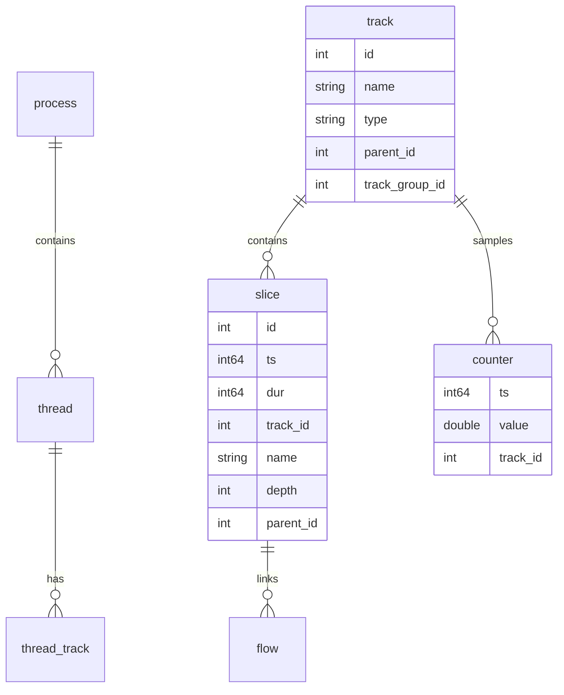
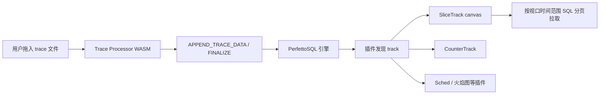
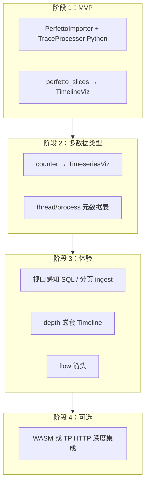

# 支持 Perfetto Trace

本文档分析 [Perfetto](https://perfetto.dev) trace 文件格式与 UI 显示能力，并给出在 PulseView 中接入的实现路线，供后续开发跟踪。

> 相关文档：[整体设计](design.md)（Perfetto 为参考架构之一）· [架构图](architecture.md) · [扩展新格式](add_new_format.md) · [LTTng/ros2_tracing](ros2_tracing.md)

## 背景

PulseView 当前已具备：

- **FormatImporter 插件体系**（MCAP / Protobuf / CTF）
- **DuckDB 中间层** + `_pv_table_meta` 自描述 schema
- **TimelineViz**（`table_kind=span`，`_time` + `_dur` + 泳道维度）

`design.md` 阶段 5 已将「大文件流式 ingest、视口感知查询」列为可选工作；Perfetto 接入可沿现有 span 契约渐进实现，无需重写前端框架。

---

## 1. Perfetto trace 文件格式

Perfetto 不是单一二进制布局，而是一套 **「多格式输入 → Trace Processor 归一化 → SQL 查询 → UI 渲染」** 的体系。

### 1.1 原生格式：Protobuf `TracePacket` 流

最常见扩展名：`.perfetto-trace`、`.pftrace`、`.pb`（内容相同）。

```
[tag varint][length varint][TracePacket protobuf bytes]  × N
```

- 每个 `TracePacket` 的 `oneof data` 可承载几十种 payload：`track_event`、`track_descriptor`、`ftrace_event_bundle`、`chrome_trace_event`、`process_tree` 等
- Schema 根定义：`perfetto/protos/perfetto/trace/trace_packet.proto`
- 线格式是**无封装的 packet 序列**（不必先包在 `Trace { repeated TracePacket }` 里）

### 1.2 Trace Processor 自动支持的其它输入

Trace Processor 通过 `GuessTraceType()` 自动嗅探（`src/trace_processor/util/trace_type.h`）：

| 类型 | 典型输入 |
|------|----------|
| `kProtoTraceType` | 原生 Perfetto protobuf |
| `kJsonTraceType` | Chrome JSON trace（`{` 或 `[{` 开头） |
| `kSystraceTraceType` | Android systrace HTML/文本 |
| `kPerfDataTraceType` | Linux `perf.data` |
| `kFuchsiaTraceType` / `kGeckoTraceType` | Fuchsia / Firefox profiler |
| `kZipFile` / `kGzipTraceType` / `kTarTraceType` | 压缩/归档容器（解压后递归检测） |
| 等 | 见 `trace_type.h` 完整枚举 |

**结论**：PulseView **不应**自行解析 protobuf；应复用 Trace Processor，只消费其 SQL 表。

### 1.3 格式转换工具

`traceconv` 可将 proto 转为 Chrome JSON / systrace / textproto 等（`perfetto/docs/quickstart/traceconv.md`）。PulseView ingest 路径无需依赖它。

---

## 2. Trace Processor 数据模型

所有格式最终归一化为 **SQLite + PerfettoSQL**。核心概念：



| 概念 | 含义 | UI 用途 |
|------|------|---------|
| **Track** | 一条时间轴行（线程、CPU、counter 轨道等） | 左侧 track 树 + 泳道 |
| **Slice** | 时间区间 `[ts, ts+dur)` | 矩形块；`depth` 表示嵌套；`dur=0` 为 instant |
| **Counter** | 采样点 `(ts, value)` | 折线/面积图轨道 |
| **Flow** | `slice_out → slice_in` 因果链 | 跨 track 箭头 |
| **Thread / Process** | `utid` / `upid` 稳定 ID | track 命名、分组 |
| **sched** | CPU 调度事件 | 独立甘特视图（非 slice 模型） |

SDK 写入侧：`TrackDescriptor` 声明 track，`TrackEvent` 写 slice/counter/flow（`track_event.proto`）。

Schema 定义参考：`src/trace_processor/perfetto_sql/stdlib/prelude/after_eof/{views,tracks,counters}.sql`

---

## 3. Perfetto UI 显示能力

`ui.perfetto.dev` 是纯前端 SPA（无后端），内嵌 **Trace Processor WASM**。



关键点：

1. **不一次性加载全量 slice**——`SliceTrack` 按可见 `[t_min, t_max]` 查 SQL（虚拟表 + 分页）
2. **Track 树**——`__tracks_to_create` 物化表 + 嵌套 `parent_id`
3. **Slice 嵌套**——同一 track 上按 `depth` 分层绘制
4. **Flow 箭头**、选中详情面板（args）、minimap、critical path 等由插件组合
5. 大文件可走 `trace_processor --http-server` RPC，而非 WASM

### 3.1 程序化解析 API

| 接口 | 路径 / 用法 | 说明 |
|------|-------------|------|
| **Python** | `pip install perfetto` → `TraceProcessor(trace=...).query(...)` | 启动 `trace_processor_shell` 子进程，经 RPC 执行 SQL |
| **C++** | `include/perfetto/trace_processor/trace_processor.h` | `Parse()` + `ExecuteQuery()`，适合嵌入 |
| **WASM + RPC** | `trace_processor.proto` + UI `Engine` | 浏览器内完整解析 |
| **CLI** | `tools/trace_processor` | 交互 SQL / HTTP server |

**没有**独立的「纯 Python 解析 `.perfetto-trace`」库；标准路径是 **Trace Processor + SQL**。

典型查询（构建 viewer 时最有用）：

```sql
SELECT ts, dur, name, track_id, depth FROM slice
  WHERE track_id IN (...) AND ts >= ? AND ts <= ?;

SELECT ts, value FROM counter WHERE track_id = ? AND ts >= ? AND ts <= ?;

SELECT * FROM track WHERE type = 'thread_track';
SELECT slice_out, slice_in FROM flow;
SELECT utid, tid, name, upid FROM thread;
```

文档：`perfetto/docs/analysis/trace-processor-python.md`

---

## 4. PulseView 现状对比

| 维度 | PulseView 现状 | Perfetto |
|------|----------------|----------|
| 中间层 | DuckDB + `_pv_table_meta` | Trace Processor SQLite |
| Timeline 输入 | `_time` + `_dur` + `track` + `name` | `slice` 表 + `track_id` + `depth` |
| 图表选择 | query `meta` → VizRegistry | 插件 + TrackRenderer |
| 数据加载 | ingest 时**全量**写入 DuckDB | 解析后按需 SQL 查询 |
| Track 树 | 单层 `dimension_keys[0]` | 嵌套 track + track_group |
| 嵌套 slice | 不支持 | `depth` / `parent_id` |
| Counter | TimeseriesViz（MCAP 指标） | 独立 counter track |
| Flow / sched / 火焰图 | 无 | 内置多种插件 |

**可复用点**：PulseView 的 `FormatImporter → DuckDB → meta 驱动 Viz` 与 Perfetto「ETL 到统一表再可视化」一致；**slice → span 表** 即可立刻复用 `TimelineViz`。

当前 CTF/LTTng 路径（`lttng_ctf.py`）手写事件配对；Perfetto 路径下 **不必 per-tracepoint 写 parser**，Trace Processor 已归一化到 `slice`/`counter`/`track`。

---

## 5. 接入路线

### 路线 A：最小可用（推荐先做）

**实现 `PerfettoImporter`，用 Trace Processor Python API 导出 slice → DuckDB span 表**

```
.pftrace
  → TraceProcessor (子进程 trace_processor_shell)
  → SQL: slice JOIN track → 行映射
  → 归一化 _time/_dur（相对 trace 起点 ns）
  → perfetto_slices 表 (table_kind=span)
  → 现有 TimelineViz 零改动
```

| 优点 | 缺点 |
|------|------|
| 复用 Perfetto 全部格式嗅探 | 依赖 `pip install perfetto` + `trace_processor_shell` |
| 与 CtfImporter 同模式 | 仅 slice，无嵌套/flow |
| 前端只加 Form 插件 | 大 trace 全量 import 可能慢 |

**后端改动点**（与 CTF 平行）：

```
backend/app/ingest/importers/perfetto_importer.py   # FormatImporter
backend/app/ingest/perfetto_tp.py                   # TraceProcessor 封装
store.PLUGIN_META["perfetto"] = ["ingest", "schema", "sql"]
fronted/src/plugins/perfetto/                       # Form + QueryPanel
```

**示例 SQL（ingest 时）**：

```sql
-- slice → span
SELECT
  s.ts - (SELECT MIN(ts) FROM slice) AS _time,
  s.dur AS _dur,
  COALESCE(p.name || '/' || th.name, t.name) AS track,
  s.name
FROM slice s
JOIN track t ON s.track_id = t.id
LEFT JOIN thread_track tt ON t.id = tt.id
LEFT JOIN thread th ON tt.utid = th.utid
LEFT JOIN process p ON th.upid = p.upid
WHERE s.dur > 0;
```

### 路线 B：多表 + 渐进增强 UI

在路线 A 基础上 ingest 多张 DuckDB 表：

| DuckDB 表 | `table_kind` | 前端 |
|-----------|--------------|------|
| `perfetto_slices` | `span` | TimelineViz（后续可加 `depth` 嵌套） |
| `perfetto_counters` | `timeseries` | TimeseriesViz |
| `perfetto_flows` | 自定义 | 新 FlowViz 或仅 SQL |
| `perfetto_threads` | 维度表 | Schema 浏览 / JOIN |

**counter 示例 SQL**：

```sql
SELECT ts - base AS _time, value AS metric, t.name AS track
FROM counter c JOIN track t ON c.track_id = t.id;
```

需扩展：`TimelineViz` 支持 `depth` 列，或新增 `NestedTimelineViz`。

### 路线 C：嵌入 Trace Processor（接近 ui.perfetto.dev）

| 子方案 | 做法 | 适合 |
|--------|------|------|
| **C1 WASM 前端** | 前端加载 `trace_processor.wasm`，trace 不经过 DuckDB | 大文件、完整 Perfetto UI |
| **C2 TP HTTP 后端** | 后端起 `trace_processor --http-server`，API 转发视口 SQL | 服务端分析、团队共享 |

与 PulseView「DuckDB 统一中间层 + SQL 探索」部分冲突，工作量大，能力最全。

---

## 6. 推荐分阶段实现计划



### 阶段 1：MVP ✅ 已完成

- [x] `PerfettoImporter`（`backend/app/ingest/importers/perfetto_importer.py`）：`settings['perfetto.path']` 指向 trace 文件
- [x] `perfetto_tp.py`：封装 `TraceProcessor`（二进制定位 `PULSEVIEW_TP_SHELL` > PATH），缺依赖时 `is_available()` + 明确错误
- [x] `inspect()`：返回 track 列表（泳道 + 区间数）
- [x] `ingest()`：slice → `perfetto_slices`（`table_kind=span`，列：`span_id`, `_time`, `_dur`, `track`, `name`, `depth`, `category`）
- [x] `store.PLUGIN_META["perfetto"]` + `importers/__init__.py` 注册
- [x] 前端 `plugins/perfetto/`（Form + QueryPanel，复用 SqlGraph）+ `plugins/index.ts` 注册
- [x] 单测：`tests/test_perfetto_importer.py`（Chrome JSON 夹具，缺 `trace_processor_shell` 时 skip）
- [x] 测试样本：`scripts/gen_perfetto_sample.py` → `../test2/perfetto_sample.json`
- [x] `requirements.txt` 注释：`perfetto` 为可选依赖
- [ ] E2E：建源 → ingest → Timeline 渲染（后续补）

**实现说明**：
- 主路线用 Trace Processor（支持 `.perfetto-trace` / `.pftrace` / Chrome JSON / systrace 等全部格式）。
- 测试夹具用 Chrome JSON（Trace Processor 归一化为同一套 `slice`/`track` 表，与原生 protobuf 解析路径一致），避免生成 `.pftrace` 所需的 protobuf 6.x 与项目运行时 5.x 冲突。
- track 名优先「进程/线程」，回退 `track.name`；仅取 `dur > 0` 的区间；时间归一到 trace 起点纳秒。

**依赖安装**：

```bash
cd PulseView/backend
.venv/bin/pip install perfetto                 # Python 库
# trace_processor_shell：apt 安装或从 https://get.perfetto.dev/trace_processor 获取
which trace_processor_shell                     # 确认在 PATH，或设 PULSEVIEW_TP_SHELL
.venv/bin/python -c "from app.ingest import perfetto_tp; print(perfetto_tp.is_available())"
```

### 阶段 2：多数据类型

- [ ] `perfetto_counters` → `table_kind=timeseries`，自动启用 TimeseriesViz
- [ ] Schema 多表 preset（SqlGraph 按 `table_kind` 切换）
- [ ] `inspect()` 返回 counter track 列表

### 阶段 3：体验（对应 design.md 阶段 5）

- [ ] ingest 分块 + 进度（Parse / Sort / Finalize 语义）
- [ ] 查询 API 支持视口过滤：`WHERE _time BETWEEN ? AND ?`
- [ ] Timeline 嵌套 slice（`depth` 列）
- [ ] Flow 可视化（可选）

### 阶段 4：可选

- [ ] 评估 iframe / 组件化嵌入 Perfetto UI
- [ ] 或 `trace_processor --http-server` 与 PulseView API 桥接

---

## 7. 与 LTTng/ros2_tracing 的关系

| | LTTng / ros2_tracing | Perfetto |
|--|---------------------|----------|
| 解析 | 手写 bt2 事件 handler（`lttng_ctf.py`） | Trace Processor 一次搞定 |
| 扩展新事件 | 常要加 handler 或配对规则 | 多数已在 `slice` 里，改 SQL 即可 |
| 依赖 | 系统 `python3-bt2` | `pip install perfetto` |
| PulseView 插件 | `ctf` | 建议独立 `perfetto` |

若 ROS2 未来通过 Perfetto SDK 写 trace，可复用同一条 `PerfettoImporter`，与 CTF 插件并存。

---

## 8. 关键参考路径（perfetto 仓库）

| 主题 | 路径 |
|------|------|
| TracePacket schema | `protos/perfetto/trace/trace_packet.proto` |
| 格式检测 | `src/trace_processor/util/trace_type.{h,cc}` |
| SQL schema | `src/trace_processor/perfetto_sql/stdlib/prelude/after_eof/` |
| UI track 插件 | `ui/src/plugins/dev.perfetto.TraceProcessorTrack/` |
| Slice 渲染 | `ui/src/components/tracks/slice_track.ts` |
| Python API | `python/perfetto/trace_processor/api.py` |
| 架构文档 | `docs/design-docs/trace-processor-architecture.md` |
| Python 文档 | `docs/analysis/trace-processor-python.md` |

---

## 9. 决策摘要

| 目标 | 建议 |
|------|------|
| 快速在 PulseView 打开 `.pftrace` 看 Timeline | **路线 A**：`PerfettoImporter` + slice→span |
| 还要看 CPU counter、内存等 | **路线 B**：多表 + TimeseriesViz |
| 接近 ui.perfetto.dev 全功能 | **路线 C**：WASM/HTTP 集成或外链 Perfetto UI |
| 不要自己解析 protobuf | 始终通过 Trace Processor |

**推荐第一步**：Trace Processor 当解析引擎，DuckDB 当查询缓存，slice 表映射到现有 span 契约，Timeline 直接复用。
