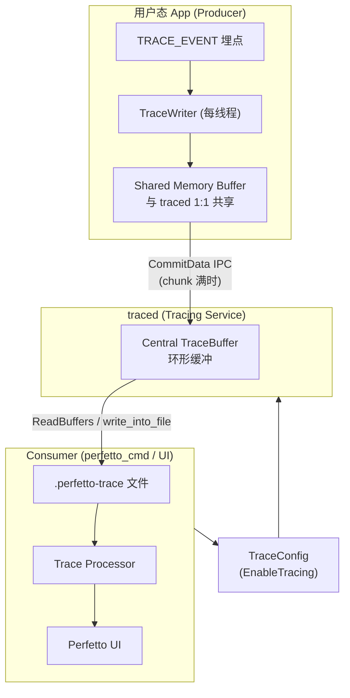
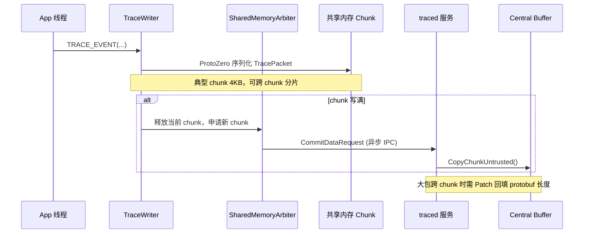
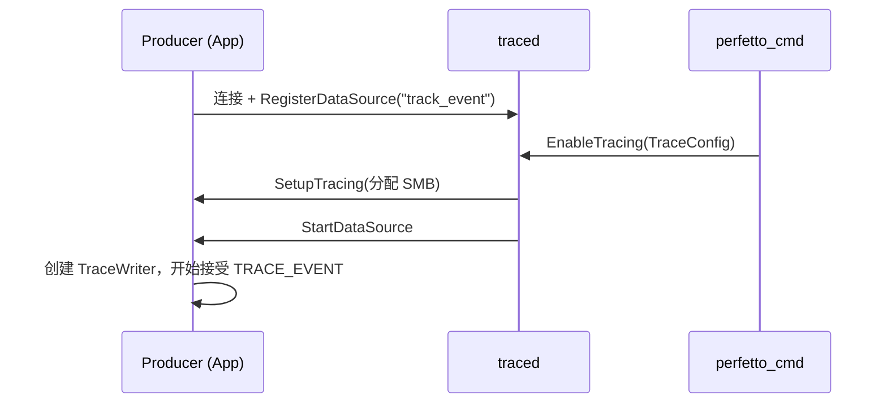
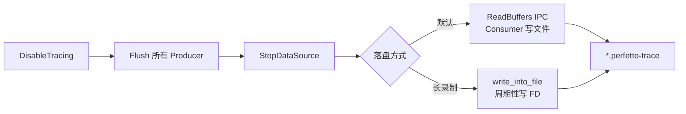
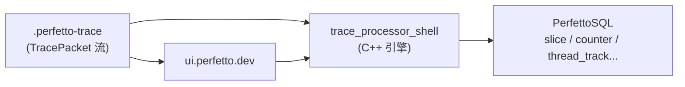

# Perfetto 性能监控原理

本文分析 Perfetto 用户态 App 记录监控数据的原理，以及从数据产生、收集落盘到分析的完整 pipeline。

## 一、整体架构（Producer / Service / Consumer）



三类角色：

| 角色 | 职责 |
|------|------|
| **Producer** | 用户态 App 进程，向 Service 贡献数据；每个 Producer 有 **一块独占共享内存** + 一条 IPC |
| **Service (`traced`)** | 守护进程，管理 TraceBuffer、路由配置、把 SMB 数据搬进中央缓冲 |
| **Consumer** | 发起录制（`perfetto_cmd`、Android `perfetto` CLI、Chrome DevTools 等），读缓冲并落盘 |

## 二、用户态 App 如何记录监控数据

### 2.1 开发者侧：Track Event SDK

App 通过 **Perfetto Tracing SDK** 埋点，典型用法：

```cpp
// 初始化
perfetto::Tracing::Initialize(args);  // kSystemBackend → 连 traced
perfetto::TrackEvent::Register();

// 埋点（RAII 作用域事件）
void DrawPlayer() {
  TRACE_EVENT("rendering", "DrawPlayer");
  // ...
}
```

事件类型：

- **Slice**：有时间范围的嵌套操作（函数、I/O、用户旅程）
- **Counter**：瞬时数值（内存、帧率）
- **Flow**：跨线程/跨 Track 的因果链

每个事件挂在一条 **Track** 上（通常对应一个线程的时间线）。

### 2.2 热路径：为什么快？

设计原则：

1. **直接写共享内存**，零拷贝、零 syscall
2. **写路径优化**，读路径可慢（见 [2.2.1](#221-写路径优化读路径可慢)）
3. Producer 之间 **互不可见**，避免信息泄露

#### 2.2.1 写路径优化，读路径可慢

这是 Perfetto 最核心的架构取舍，官方表述为：

> *Highly optimized for low-overhead writing. NOT optimized for low-latency reading.*

Tracing 是 **多写者、单读者** 的异步流水线（类似 GPU command buffer）。埋点可能出现在 Android/Chrome 全工程每个函数入口，**写路径是热路径**，分析发生在录制结束之后，**读路径是冷路径**。因此所有复杂度尽量后移到读侧。

##### 为什么写路径必须极快？

开销不只是 `TRACE_EVENT` 本身的 CPU 时间，还包括：

- **I-cache / D-cache 污染**：埋点代码和数据挤占缓存，拖慢埋点之后的业务代码（见 [2.2.2](#222-i-cache--d-cache-污染如何缓解)）
- **分配与 syscall**：`malloc`、`write()` 等会触发内核态切换和锁竞争
- **频率极高**：调度、渲染、网络等路径每秒可产生数万～数百万事件

因此写路径的目标是：**让 99% 的埋点等价于几次内存写**。

##### 写路径做了哪些优化？

| 层次 | 写路径（热） | 具体手段 |
|------|-------------|----------|
| **序列化** | App 线程内 | ProtoZero：零拷贝、零分配、零 syscall；只生成序列化代码，不生成反序列化 |
| **缓冲** | App 进程内 | 直接写入与 `traced` 共享的 SMB，不经 IPC |
| **并发** | 每线程一个 TraceWriter | 同 chunk 内 **无锁**；仅 chunk 写满（约 4KB）时才走 slow-path 抢新页 |
| **IPC** | 异步、批量 | chunk 满才 `CommitData`，不是每个事件一次 IPC |
| **编码技巧** | 延迟回填 | 嵌套 protobuf 长度未知 → 先占位 4 字节，Finalize 时 patch；跨 chunk 则 patch 随下次 IPC 捎带 |
| **字符串** | 写时 intern | 事件名/参数名只发一次 ID，后续事件只写整数，减小写侧体积 |

ProtoZero 与 libprotobuf 的对比体现了这一思路：

- **libprotobuf**：先填 C++ 对象（string/vector 有拷贝），再遍历序列化 → 两次 pass，分配多
- **ProtoZero**：`set_xxx()` 直接把 varint/bytes 追加到 chunk 尾部 → 一次 pass，无中间对象

TraceWriter 的接口注释也点明了设计意图：

> *write protobufs directly into the tracing shared buffer without making any copies*
> *Each TraceWriter will get its own dedicated chunk and will write without any locking most of the time*

典型 `TRACE_EVENT` 的 fast-path：

```
TRACE_EVENT → ProtoZero 追加字节到 thread-local chunk → 返回
              （无锁、无分配、无 syscall、无 IPC）
```

slow-path 仅在 chunk 边界触发（每 4KB～32KB 一次）：

```
chunk 写满 → 抢 mutex → 向 SharedMemoryArbiter 申请新 chunk → 异步 CommitData IPC
```

##### 读路径为什么可以慢？

读发生在 **录制结束** 或 **周期性落盘** 时，不在业务热路径上。读侧可以承担写侧故意推迟的复杂度：

| 阶段 | 读路径（冷） | 允许的复杂操作 |
|------|-------------|---------------|
| **SMB → Central Buffer** | `traced` 服务 | `CopyChunkUntrusted()`、校验、按 Sequence 归档 |
| **Central Buffer 读出** | 落盘 / IPC | 重组跨 chunk 分片的 packet、应用 patch、处理 ring buffer 覆盖 |
| **Trace Processor 导入** | 离线分析 | 完整 protobuf 解析、intern 字典重建、时钟同步、建 SQL 表 |
| **UI 渲染** | 浏览器 | 按 track 聚合 slice、火焰图、SQL 查询 |

TraceBuffer 的读回逻辑远比普通环形缓冲复杂：要按 `{ProducerID, WriterID}` Sequence 保证 FIFO、重组分片 packet、回填 patch、标记 `previous_packet_dropped`。这些在 `trace-buffer.md` 中明确是 **readback time** 才做的事。

ProtoZero 文档也写明：**反序列化是后来才加的，主要用于 Trace Processor 等离线工具**；零拷贝零分配的承诺 **仅适用于序列化（写）侧**。

##### 两级缓冲如何体现这一取舍？

```
写侧（Producer）                    读侧（Service / 分析）
─────────────────                  ─────────────────────
SMB：staging，隐藏 traced 调度延迟    Central Buffer：汇聚、ring/discard
  ↑ 写快，允许 traced 暂时跟不上      ↑ 读慢没关系，后台慢慢搬
  ↑ 默认 256KB ≈ 扛 10ms@8MB/s       ↑ 落盘时可整块 ReadBuffers
```

Producer 只管往 SMB 写；`traced` 被调度阻塞时，SMB 吸收突发，避免拖慢 App。这是 **用内存换写路径延迟**——读侧晚一点把数据搬走是可以接受的。

##### 写快读慢带来的代价（有意接受）

1. **无跨 Sequence 的全局顺序**：不同线程的 TraceWriter 并发写，文件里不保证全局时间序（读时再按 timestamp 排序）
2. **Incremental state 可能丢失**：intern 字典等状态在 ring buffer 覆盖后会断链，后续事件解析失败——写侧不为保状态付出额外同步成本
3. **数据可能丢**：SMB 满、`traced` 阻塞过久、Central Buffer ring 覆盖 → 写侧选择 **丢数据也不阻塞 App**（除非显式 `kStall`）
4. **分析工具更重**：Trace Processor 要做大量后处理，但这是离线一次性成本

##### 与 PulseView 的类比

| | Perfetto 写路径 | Perfetto 读路径 | PulseView (MCAP ingest) |
|--|--------------|----------------|-------------------------|
| 时机 | 运行时每个埋点 | 录制后 / 周期性 | 导入时一次性 |
| 目标 | 纳秒～微秒级 | 秒～分钟级可接受 | 秒级可接受 |
| 策略 | 共享内存 + 无锁写 | 重组 + 解析 + 建表 | SQL + DuckDB 建表 |

**一句话**：Perfetto 把 tracing 当成 **append-only 日志**——写的时候只追加字节，读的时候再把它变成结构化、可查询、可可视化的数据。

#### 2.2.2 I-cache / D-cache 污染如何缓解

Perfetto **并没有彻底消除** cache 污染——埋点代码终究要占指令、占数据。策略是：**把污染压到最小，并且让绝大多数时间里埋点几乎不执行任何重逻辑**。

官方在 `protozero.md` 中的表述：tracing 开销不只是埋点本身的 CPU 时间，还包括埋点拉进来的 **working set** 会让埋点**之后**的业务代码多打 I-cache / D-cache miss。

##### 核心：未录制时走极短 fast-path

`TRACE_EVENT` 展开后，第一步不是序列化，而是检查 category 是否 enabled：

```cpp
uint32_t instances = category_state->load(std::memory_order_relaxed);
if (PERFETTO_LIKELY(!instances))
  return;  // tracing 未开启 → 直接返回
// 只有 enabled 才进入序列化 / TraceWriter / SMB
```

设计目标（`track_event_data_source.h`）：*compile down to an unlikely conditional jump to the actual trace writing function*。

- **未录制时**：一次 relaxed atomic load + 一次 highly-likely 分支 → 返回
- **不进入** ProtoZero、TraceWriter、SMB 等重代码
- 分支预测器把「不录制」当成常态，业务代码的 I-cache 流几乎不被打断

Category enabled 状态还做了 **cache locality 优化**（`track_event_macros.h`）：

- category **名字**（冷数据）与 **enabled 位图**（热数据）分开存储
- enabled 位用 `std::atomic<uint8_t>` 打包，每个 category 只占 1 字节
- 埋点只 touch 那 1 字节，不把整段 category 名字字符串拉进 D-cache

##### 减小 I-cache 污染：代码要「小」且「可内联」

| | libprotobuf | ProtoZero |
|--|-------------|-----------|
| 每个 message | 生成完整 C++ 类（string/vector 成员、拷贝构造等） | 只有 inline `set_xxx()` → `AppendVarInt()` |
| 二进制体积 | 与定义的 proto 数量/字段数强相关 | **只与实际调用的 `set_*` 数量相关** |
| 序列化 | 先填对象，再遍历序列化（两次 pass） | 一次 append，编译器可完全内联展开 |

其他手段：

- Category 名 → **编译期** `constexpr` 查 registry 得到 `category_index`
- Event 名要求 **编译期字符串常量**；动态 category / 动态 event 名可用但开销更大
- SDK 是 amalgamation（`perfetto.h` + `perfetto.cc`），反序列化代码 **不进** Producer 热路径

##### 减小 D-cache 污染：热路径零分配、顺序写

- ProtoZero 的 `AppendBytes` 直接追加到 chunk 尾部，**无 malloc、无临时 string/vector**
- 每线程一个 TraceWriter + 专属 chunk → **无锁**，4KB 内顺序 append，D-cache line 利用率高
- Interning：事件名等字符串只发一次，后续只写整数 iid，减少写侧数据搬运
- TraceWriter、incremental state 放在 **TLS**，埋点主要 touch TLS + 当前 chunk

##### 架构级隔离：重逻辑不进 App 热路径

```
App 写路径（热）              分析路径（冷，独立进程）
ProtoZero 序列化       →     Trace Processor 反序列化
SMB 追加               →     建 SQL 表、UI 渲染
```

Producer 不链接完整 protobuf 解析器、SQL 引擎、UI——大 working set 被推到离线工具，不挤占 App 的 I-cache。

##### 录制开启时：用 Category 控制污染范围

```protobuf
enabled_categories: ["rendering"]
disabled_categories: ["*"]
```

未 enable 的 category 仍走 `PERFETTO_LIKELY(!instances)` 快速返回。Chrome/Android 默认 disable `slow`、`debug` 等 tag。**录制时一定会有 cache 污染**，目标是只污染真正要看的子系统。

##### 小结

```
未录制（常态）                    录制中（偶发）
─────────────                    ─────────────
atomic load 1 字节               + ProtoZero inline append
likely branch → return           + TLS TraceWriter
~几条指令                        + 4KB chunk 顺序写
I/D-cache 几乎无影响             有污染，但已压到最小

刻意不做的事：
✗ 每个埋点 malloc
✗ 每个埋点 syscall/IPC
✗ 链接 libprotobuf 解析器到 App
✗ 在 App 里做复杂字符串处理
```

与 PulseView 对比：MCAP ingest 是离线批处理，不存在「埋点污染业务代码 cache」的问题；Perfetto 面对的是埋点嵌在渲染/调度热循环里，必须把 fast-path 压到几条指令。

序列化用 **ProtoZero**：

- 专为 tracing 设计：**零拷贝、零分配、零 syscall**
- 每个 trace event 就是一个 `TracePacket` protobuf
- 比 libprotobuf 更轻，适合遍布全工程的埋点

### 2.3 写入链路（单条事件的生命周期）



对应 `life-of-a-tracing-session.md` 中的步骤：

1. 每个 **DataSource** 创建若干 **TraceWriter**（通常每线程一个）
2. `TraceWriter` 向 SMB 的 **Chunk**（约 4KB）写 `TracePacket`
3. Chunk 写满 → `SharedMemoryArbiter` 通过 **CommitData** IPC 交给 Service
4. 跨 Chunk 的大包需要 **Patch** 回填 protobuf 长度（先写 0 占位，写完再 patch）
5. Service 把 Chunk 拷进 **Central TraceBuffer**（`TraceBufferV2` 环形缓冲）

**关键点：埋点热路径只有内存写；IPC 仅在 chunk 提交、Flush、启停时出现。**

### 2.4 两种 Backend

```cpp
args.backends |= perfetto::kInProcessBackend;  // 仅进程内
args.backends |= perfetto::kSystemBackend;    // 连 traced，可与 ftrace 等同轴展示
```

- **In-Process**：不依赖 `traced`，适合单机调试
- **System**：Android P+ / Linux 上连 `traced`，可与内核 ftrace、调度、GPU 等合并

### 2.5 缓冲两级结构

| 层级 | 位置 | 作用 |
|------|------|------|
| **SMB（蓝）** | Producer 进程内，与 traced 共享 | 写侧 staging，默认约 256KB，隐藏 traced 调度延迟 |
| **Central Buffer（黄）** | traced 进程内 | 最终内存汇聚点，按 TraceConfig 设大小与 ring/discard 策略 |

数据流：

```
App TraceWriter → SMB 页写满 → CommitData IPC → Central Buffer → 落盘
```

## 三、完整 Pipeline：从产生到落盘到分析

### Phase 1：注册与配置



- Producer 先 **RegisterDataSource**，默认不录
- Consumer 发 **TraceConfig**：启用哪些数据源、缓冲大小、ring/discard、写哪个 buffer
- Service 给 Producer 分配 SMB，发 **StartDataSource**

### Phase 2：录制中

- App 持续 `TRACE_EVENT` → SMB
- Chunk 满 → **CommitData**（异步）
- 可选 **flush_period_ms**：定期 Flush，避免事件在 SMB 里滞留过久
- 若启用 **ftrace**：内核 per-CPU 缓冲 → `traced_probes` 读 → 同样进 Central Buffer（多一级内核缓冲）

### Phase 3：结束与落盘



- **Flush**：强制提交 SMB 中未满的页
- **ReadBuffers** 或 **write_into_file**：输出 protobuf 编码的 trace 文件
- 长录制（`write_into_file` + `RING_BUFFER`）：边录边写，Central Buffer 作 ring 解耦 I/O

### Phase 4：分析与可视化



| 组件 | 作用 |
|------|------|
| **Trace Processor** | 解析多种格式，导入为统一 SQL 表（`slice`、`counter`、`thread_track` 等） |
| **Perfetto UI** | 时间轴、火焰图、SQL 查询面板 |
| **PerfettoSQL** | 对 trace 做 SQL 分析（如 `SELECT ts, dur, name FROM slice`） |

Track Event 在导入时会处理 **字符串 interning**（描述符只发一次，后续用 ID 引用）；若 ring buffer 覆盖导致描述符丢失，后续事件可能无法完整解析。

## 四、与 PulseView 方案的对比

| 维度 | Perfetto | PulseView (MCAP + DuckDB) |
|------|----------|---------------------------|
| 数据产生 | App 埋点 `TRACE_EVENT` | ROS2 发布 `SystemStats` msg |
| 进程内缓冲 | SMB + ProtoZero | 无（直接 MCAP 写文件或内存） |
| 汇聚 | traced Central Buffer | DuckDB ingest |
| 落盘 | `.perfetto-trace` (protobuf) | `.duckdb` / 可再导出 |
| 分析 | Trace Processor + PerfettoSQL | SQL 查询 + 自研图表 |
| 热路径 | 共享内存零拷贝 | 取决于 MCAP 录制链路 |

## 五、关键设计取舍

1. **写快读慢**：埋点遍布全工程，必须极低开销；分析在离线阶段进行。
2. **SMB 解耦**：traced 被调度阻塞时，App 仍可写 SMB（默认 256KB 可扛约 10ms @ 8MB/s）。
3. **Chunk + Patch**：protobuf 长度未知时需跨 chunk 分片，用 Patch 协议保证完整性。
4. **Sequence 有序**：同一 `TraceWriter` 的 packet 在文件里保持 FIFO；不同 Writer 之间无全局时间序保证。
5. **Ring Buffer**：内存有限时覆盖旧数据，并记录 `previous_packet_dropped` 等丢包标记。

## 六、Perfetto 源码文档索引

源码位于 `pv/perfetto/`：

| 主题 | 路径 |
|------|------|
| 一次录制全流程 | `perfetto/docs/design-docs/life-of-a-tracing-session.md` |
| 缓冲与数据流 | `perfetto/docs/concepts/buffers.md` |
| Track Event 埋点 | `perfetto/docs/instrumentation/track-events.md` |
| SDK 接入 | `perfetto/docs/instrumentation/tracing-sdk.md` |
| 服务模型 | `perfetto/docs/concepts/service-model.md` |
| ProtoZero 序列化 | `perfetto/docs/design-docs/protozero.md` |
| TraceBuffer 内部 | `perfetto/docs/design-docs/trace-buffer.md` |
| Trace Processor 分析 | `perfetto/docs/analysis/trace-processor.md` |

## 七、可运行示例

`PulseView/examples/perfetto/` 提供最小 Track Event 示例（CMake + in-process tracing）：

```bash
cd PulseView/examples/perfetto

# 若缺少 SDK（sdk/perfetto.h）
./fetch_sdk.sh

cmake -B build -DCMAKE_BUILD_TYPE=Release
cmake --build build -j
./build/pulseview_perfetto_example
```

默认输出 `pulseview_example.pftrace`，可在 [ui.perfetto.dev](https://ui.perfetto.dev) 打开。
