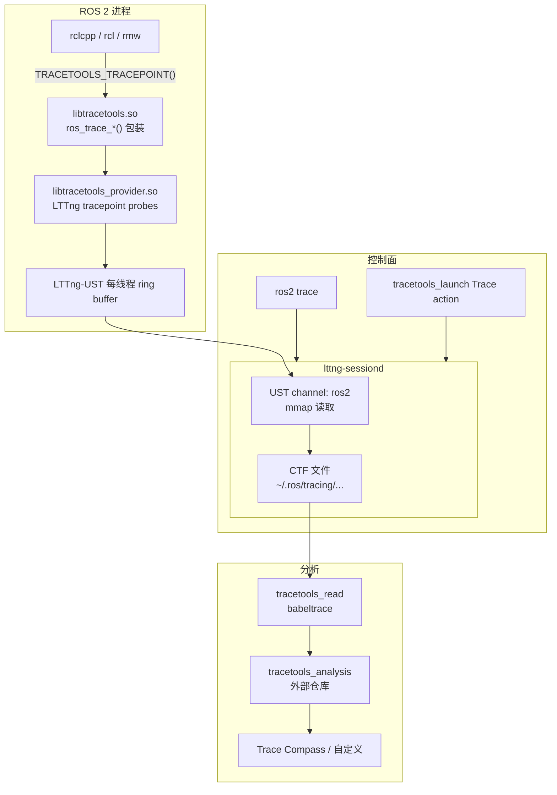
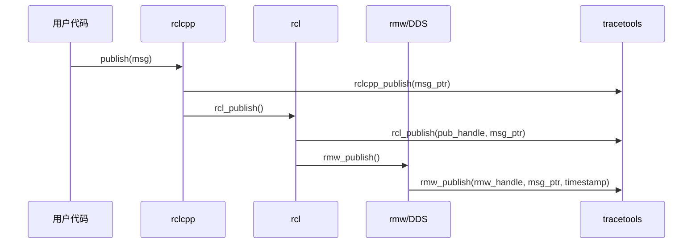
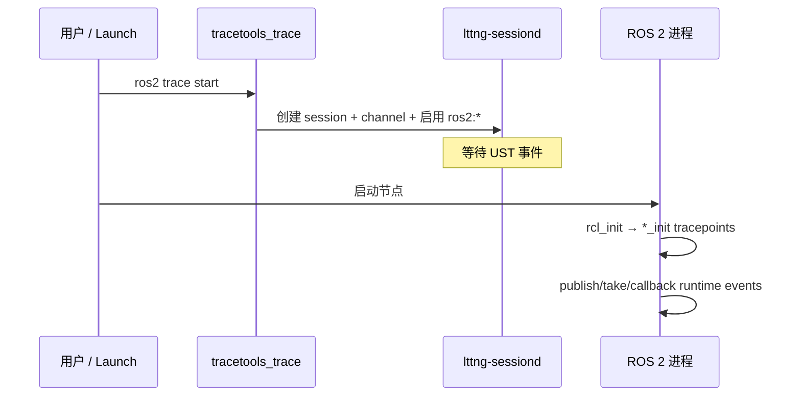
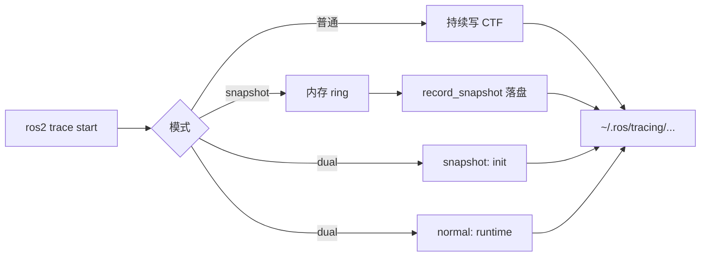
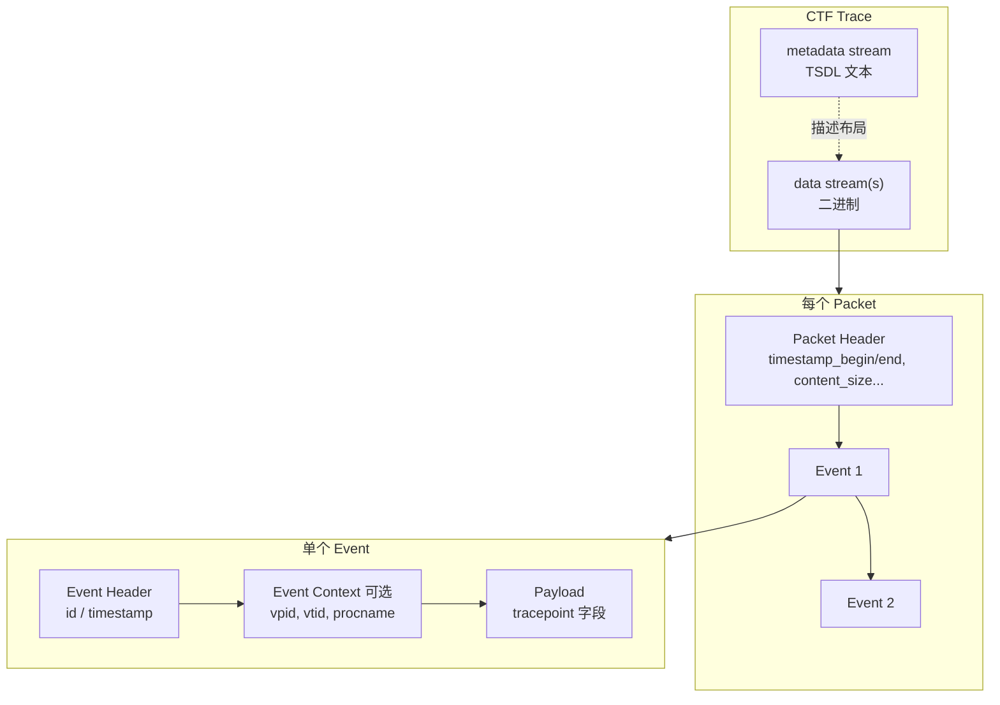
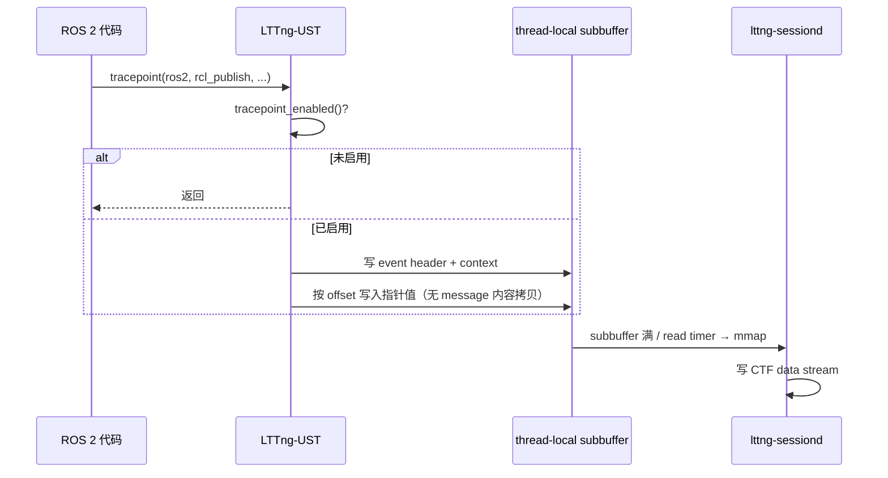

# ROS 2 Tracing 原理（ros2_tracing / tracetools）

本文分析 `ros2_tracing` 中 `tracetools` 的实现原理，以及从 ROS 2 埋点、LTTng 收集落盘到分析的完整 pipeline。

> 源码位于 `pv/ros2_tracing/`。ROS 2 tracing 基于 **LTTng-UST**（非 Perfetto），仅支持 Linux。

## 一、整体架构



| 包 | 职责 |
|----|------|
| **tracetools** | C 库：定义 tracepoint、包装 LTTng、供 rcl/rclcpp/rmw 调用 |
| **tracetools_trace** | Python：配置/启停 LTTng session |
| **ros2trace** | `ros2 trace` CLI |
| **tracetools_launch** | Launch `Trace` action，自动在节点启动前开录 |
| **tracetools_read** | 用 babeltrace 读 CTF |
| **tracetools_analysis** | 事件关联、指标计算（[独立仓库](https://github.com/ros-tracing/tracetools_analysis)） |

## 二、埋点实现原理（tracetools）

### 2.1 三层 API

ROS 2 核心代码只依赖 `tracetools/tracetools.h`：

```cpp
TRACETOOLS_TRACEPOINT(rcl_publish, publisher_handle, message);

// 可选：先检查再打点，避免昂贵参数计算
if (TRACETOOLS_TRACEPOINT_ENABLED(rmw_publish)) {
  // 计算 timestamp...
  TRACETOOLS_DO_TRACEPOINT(rmw_publish, handle, message, timestamp);
}
```

宏展开为 `ros_trace_rcl_publish()` 等函数，实现在 `tracetools.c`。

### 2.2 LTTng tracepoint 定义

`tp_call.h` 用 LTTng 宏定义 CTF 事件（provider 名 `ros2`）：

```c
TRACEPOINT_EVENT(
  TRACEPOINT_PROVIDER,  // ros2
  rcl_publish,
  TP_ARGS(const void *, publisher_handle_arg, const void *, message_arg),
  TP_FIELDS(
    ctf_integer_hex(const void *, publisher_handle, publisher_handle_arg)
    ctf_integer_hex(const void *, message, message_arg)
  )
)
```

LTTng 事件名格式：`ros2:rcl_publish`（见 `tracetools_trace/tools/tracepoints.py`）。字段如何落成二进制 CTF 记录，见 [§五](#五ctf-格式原理common-trace-format)。

### 2.3 双库动态链接

`CMakeLists.txt` 拆成两个库：

| 库 | 源文件 | 作用 |
|----|--------|------|
| **libtracetools.so** | `tracetools.c` | 包装函数；进程启动时 `dlopen` provider |
| **libtracetools_provider.so** | `tp.c` + `tp_define.c` | 真正的 LTTng probe |

```c
// tracetools.c — 构造函数
tracetools_provider_handle = dlopen("libtracetools_provider.so", RTLD_NOW | RTLD_GLOBAL);
```

```c
// tp.c
#define TRACEPOINT_CREATE_PROBES
#include "tracetools/tp_call.h"

// tp_define.c
#define TRACEPOINT_DEFINE
#define TRACEPOINT_PROBE_DYNAMIC_LINKAGE
#include "tracetools/tp_call.h"
```

设计意图：

- ROS 2 核心只链接 `libtracetools`，**不必在编译期强依赖 LTTng**
- 可单独替换 `provider` 开关 tracepoint（`TRACETOOLS_TRACEPOINTS_EXCLUDED`）
- `dlopen` 失败时 tracing 静默禁用，不影响运行

### 2.4 运行时 fast-path

`DEFINE_TRACEPOINT` 内部调用 LTTng：

```c
tracepoint(ros2, rcl_publish, ...);           // 内部先 tracepoint_enabled()
0 != tracepoint_enabled(ros2, rcl_publish);   // ENABLED 检查
do_tracepoint(ros2, rcl_publish, ...);        // DO 版本，不重复检查
```

与 Perfetto 类似：**session 未开启时**，`tracepoint_enabled()` 为 false，fast-path 无 syscall、无拷贝（论文测得约 **158ns/次** 平均延迟）。

### 2.5 三级禁用开关

| 级别 | 方式 | 效果 |
|------|------|------|
| 编译期 | `-DTRACETOOLS_DISABLED=ON` | 宏变空操作，不链接库 |
| 编译期 | `-DTRACETOOLS_TRACEPOINTS_EXCLUDED=ON` | 保留调用桩，无 LTTng |
| 运行时 | `TRACETOOLS_RUNTIME_DISABLE=1` | 跳过 `dlopen` provider |
| 运行时 | 未启动 LTTng session | `tracepoint_enabled` 返回 false |

Iron 之后 LTTng 已是 ROS 2 默认依赖，Linux 上开箱即用。

## 三、埋点覆盖与数据模型

设计文档（`doc/design_ros_2.md`）把事件分为两类：

| 类型 | 时机 | 目的 |
|------|------|------|
| **Initialization** | 节点/发布者/订阅者创建 | 建立 handle 关系图（指针、topic 名、GID） |
| **Runtime** | publish/take/callback | 记录时序，payload 尽量小 |

初始化事件在启动阶段触发，用于减小运行时 payload；分析时靠 init 事件把 handle 解析成 topic/node 名。

### 分层埋点（以 publish 为例）



**消息关联**：同一消息在不同层用 **指针地址** 串联（`rclcpp_publish` → `rcl_publish` → `rmw_publish` → `rmw_take` → `callback_start`）。跨进程需结合 DDS GID + `message_link_*` 注解。

### 主要 tracepoint 分组

| 层 | 典型事件 |
|----|----------|
| **rcl** | `rcl_init`, `rcl_node_init`, `rcl_publisher_init`, `rcl_publish`, `rcl_take` |
| **rclcpp** | `rclcpp_publish`, `callback_start/end`, `rclcpp_executor_*` |
| **rmw** | `rmw_publish`, `rmw_take`, `rmw_*_init`（含 DDS GID） |
| **intra-process** | `rclcpp_intra_publish`, `ring_buffer_enqueue/dequeue` |
| **因果链** | `message_link_periodic_async`, `message_link_partial_sync` |

`callback_start` / `callback_end` 包住订阅/服务/定时器回调，可计算 callback duration。

## 四、完整 Pipeline

### Phase 1：配置与启动（必须在 App 初始化之前）

```bash
ros2 trace                    # 交互式
ros2 trace start my_session   # 脚本友好
ros2 launch tracetools_launch example.launch.py  # Launch 自动先 trace 再启节点
```

`tracetools_trace` → `lttng_impl.py` 流程：

1. 启动/连接 `lttng-sessiond`
2. 创建 session，输出目录默认 `~/.ros/tracing/session-YYYYMMDDHHMMSS`（可用 `ROS_TRACE_DIR` 覆盖）
3. 创建 **UST channel** `ros2`：
   - `LTTNG_BUFFER_PER_UID`（每 UID 一个缓冲）
   - subbuffer 默认 8×4KB，mmap 输出
   - read timer 200ms（避免 switch timer 的 write syscall）
4. 启用 `ros2:*` tracepoint（可筛选子集）
5. 可选：kernel events、syscalls、context fields（`vpid`, `vtid`, `procname` 等）

**重要**：初始化类 tracepoint（`rcl_init`, `*_init`）在 App 启动时触发；若 session 开晚了，缺少 handle 映射，trace 可能无法分析。



### Phase 2：运行时数据流

```
ROS 代码调用 TRACETOOLS_TRACEPOINT
  → tracepoint_enabled()?
      否 → 返回（~百纳秒级）
      是 → 序列化字段到 thread-local subbuffer（无拷贝到用户态外）
  → subbuffer 满 / read timer → lttng-sessiond mmap 读走
  → 写入 CTF 文件（Common Trace Format）
```

LTTng-UST 特点：用户态实现、可重入、线程安全、**fast-path 无 syscall、无数据拷贝**。

### Phase 3：落盘模式

| 模式 | 行为 |
|------|------|
| **普通** | 持续写 CTF 到磁盘 |
| **Snapshot** | 内存 ring，按需 `record_snapshot` 落盘（飞行记录仪） |
| **Dual session** | init 用 snapshot + runtime 用普通 session，避免丢初始化数据 |



### Phase 4：读取与分析

```python
# tracetools_read
from tracetools_read import trace
events = trace.get_trace_events("~/.ros/tracing/session-xxx")
# → babeltrace 解析 CTF → List[DictEvent]
```

外部分析链：

```
CTF → tracetools_analysis → pickle/DataFrame
  → callback 耗时、message age、executor 行为、跨节点消息流
  → Trace Compass / 论文工具链
```

## 五、CTF 格式原理（Common Trace Format）

LTTng 落盘使用 **CTF**（Common Trace Format）。相对 Perfetto 的 protobuf `TracePacket`，CTF payload 更 **扁平**：每种事件的二进制布局在 metadata 里声明一次，数据流里按固定 struct 顺序追加原生类型，无 per-field tag/length 编码。

规范参考：[CTF v1.8](https://diamon.org/ctf/v1.8.2/)、[EfficiOS ctf 仓库](https://github.com/efficios/ctf)。

### 5.1 要解决什么问题？

| 需求 | CTF 的做法 |
|------|-----------|
| 写极快 | 热路径按已知 offset 追加整数/字符串 |
| 格式灵活 | 不同 event type 可有不同 layout |
| 可自描述 | **metadata 与 data 分离** |

| 部分 | 内容 | 何时写入 |
|------|------|----------|
| **Metadata stream** | TSDL 文本，描述所有 event 的二进制布局 | 录 trace 时生成 |
| **Data stream(s)** | 纯二进制 event 序列 | 每个 tracepoint 触发时追加 |

读 trace 时 babeltrace 先解析 metadata，再按描述解析 data——类似「先加载 schema，再读记录」。

### 5.2 落盘目录结构

`~/.ros/tracing/session-xxx/` 典型内容：

```
session-xxx/
├── metadata                    # TSDL：所有 ros2:* 事件的字段定义
├── index
└── ros2/                       # UST channel 名
    └── <uid>/
        └── <stream-id>_*       # 二进制 packet 流（mmap 写出）
```

`tracetools_read` 用 babeltrace 加载：

```python
tc.add_traces_recursive(trace_directory, 'ctf')
```

### 5.3 分层模型：Stream → Packet → Event



1. **Stream**：逻辑事件流；LTTng UST 常用 per-UID 一个 stream
2. **Packet**：连续二进制块，内含多个 event；对应 LTTng 的 **subbuffer**
3. **Event**：`header` + 可选 `context` + **`payload`**

Context 字段（`vpid`, `vtid`, `procname`）在 session 配置时统一附加到每条 event，不占 `TP_FIELDS` 定义，但会增加每条记录体积。

### 5.4 TSDL：描述二进制布局

Metadata 使用 **Trace Stream Description Language (TSDL)**，声明每种 event 的 payload。`ros2:rcl_publish` 在 metadata 里概念上等价于：

```c
// 概念示意，非真实 TSDL 原文
event {
    name = "rcl_publish";
    id = <编译期分配>;
    fields := struct {
        integer { size = 64; align = 8; } publisher_handle;
        integer { size = 64; align = 8; } message;
    };
};
```

**关键**：event type → 固定 struct layout；读端无需在 payload 里解析 per-field tag。

#### `ctf_*()` 宏映射

| 宏 | 含义 | ROS 2 典型用途 |
|----|------|----------------|
| `ctf_integer` / `ctf_integer_hex` | 定长整数 | handle 指针、`int64_t` timestamp |
| `ctf_string` | 以 `\0` 结尾的字符串 | `topic_name`, `node_name` |
| `ctf_array` | 定长数组 | DDS GID（16 字节） |
| `ctf_sequence` | 变长序列 | `message_link_*` 的 pub/sub 列表 |

LTTng-UST 在编译期根据宏 **生成写代码**：在 `tracepoint()` 调用点，把 C 表达式的值按 TSDL 偏移 **直接写入 subbuffer**。

### 5.5 为何 payload「扁平」？与 protobuf 对比

Protobuf（Perfetto `TracePacket`）是 **Tag-Length-Value (TLV)** 自描述流：

```
[field_tag + wire_type][value][field_tag + wire_type][length][bytes]...
```

`TracePacket` 还有多层嵌套（`track_event`、`interned_data` 等），写路径需 varint 编码、嵌套长度占位与 patch。

CTF 对固定类型 event 则是 **plain struct**：

```
| publisher_handle (8B) | message (8B) |   ← rcl_publish
```

| 维度 | CTF (LTTng) | Protobuf (Perfetto) |
|------|-------------|---------------------|
| 布局 | metadata 声明，data **无 per-field tag** | 每字段带 tag + 可能 length |
| 嵌套 | 支持 struct，ROS 2 tracepoint 极少用 | `TrackEvent` 多层嵌套是常态 |
| 类型信息 | 只在 metadata，**不重复写在每条 event** | wire format 自带类型线索 |
| 字符串 | `ctf_string`：内容 + `\0` | `bytes`：length varint + 内容 |
| 扩展 | 新 event = 新 event type + 新 ID | 新 field = 新 field number |

#### 体积示例：`rmw_publish`

```c
ctf_integer_hex(..., rmw_publisher_handle, ...)  // 8B
ctf_integer_hex(..., message, ...)               // 8B
ctf_integer(int64_t, timestamp, ...)             // 8B
```

Payload 约 **24 字节**（加 event header/context 略多）。同等语义用 protobuf 包裹 `TracePacket` + `TrackEvent` 通常更大。LTTng 文档称内核 event 平均约 **32 字节/条**。

### 5.6 写路径与读路径



读路径（离线，可慢）：

```python
for event in tc.events:
    event.name          # "ros2:rmw_publish"
    event.timestamp
    event["rmw_publisher_handle"]
    event["message"]
```

`tracetools_read` 过滤 packet 层元数据（`packet_size`, `content_size` 等），只保留业务字段。分析工具用 init 事件把 handle 解析成 topic 名，用指针在 publish/take/callback 间串消息——**关联逻辑在分析阶段，不在 CTF payload 里**。

### 5.7 设计哲学小结

| | CTF + LTTng | Perfetto + ProtoZero |
|--|-------------|----------------------|
| Schema 位置 | metadata 文件（TSDL） | `.proto` + trace 内 interned state |
| 单条记录 | 固定 struct 追加 | TLV 流 append |
| 适合场景 | 高频、字段少、布局稳定 | 字段多、嵌套、长期 schema 演化 |

ROS 2 设计刻意让 **init 事件带全量元数据、runtime 事件只带指针**——与 CTF flat struct 模型契合。

## 六、与 Perfetto 对比

### 6.1 架构与格式

| 维度 | ROS 2 tracetools (LTTng) | Perfetto |
|------|--------------------------|----------|
| 后端 | LTTng-UST + sessiond | traced + SMB |
| 埋点位置 | rcl/rclcpp/rmw 固定点 | 用户 `TRACE_EVENT` |
| 数据格式 | CTF（见 [§五](#五ctf-格式原理common-trace-format)） | `.perfetto-trace` (protobuf) |
| 关联键 | 指针 handle + DDS GID | Track ID + Flow |
| 控制 | `ros2 trace` / Launch | `perfetto_cmd` / Android |
| 分析 | babeltrace + tracetools_analysis | Trace Processor + UI |
| 平台 | 仅 Linux | Linux/Android/Chrome |

共同点：**写路径优化、读路径可慢**；未录制时靠 enabled 检查快速返回。

### 6.2 记录原理对比

| 维度 | ROS 2 trace (LTTng) | Perfetto |
|------|---------------------|----------|
| 序列化 | CTF 字段内联写入 | ProtoZero 写 `TracePacket` |
| 进程内缓冲 | 每线程 subbuffer | TraceWriter → SMB chunk (~4KB) |
| 汇聚 | sessiond mmap 读走 | `CommitData` → Central Buffer |
| 未录制 fast-path | `tracepoint_enabled()` | `PERFETTO_LIKELY(!instances)` |
| 启用粒度 | 按 tracepoint 名 | 按 category |

### 6.3 性能开销对比

> 以下数字来自公开 benchmark/论文，**不宜直接横比绝对值**（硬件、字段数、是否含 daemon 读走不同），但可用于量级判断。

#### 未录制（disabled）

两者均为几次内存读 + 分支预测，fast-path **无 syscall、无拷贝**。

#### 录制中（单次埋点）

| 来源 | 场景 | 量级 |
|------|------|------|
| [ACM tracer survey](https://dl.acm.org/doi/abs/10.1145/3158644)（ros2_tracing README 引用） | LTTng-UST 平均每次 tracepoint | **~158 ns** |
| Perfetto `protozero_benchmark`（Linux Xeon，简单事件） | 仅 ProtoZero 序列化 | **~261 ns** |
| Perfetto 同 benchmark「理论下限」 | speed-of-light serializer | **~111 ns** |
| Perfetto `api_benchmark.cc` | 完整 `TRACE_EVENT_BEGIN` | 通常 **数百 ns 级** |

单次简单事件：LTTng 文献值略低；Perfetto 因 protobuf + TrackEvent 封装略重（见 [§5.5](#55-为何-payload扁平与-protobuf-对比)）。

#### ROS 2 特有的放大效应

一次 **publish**（tracing 全开）至少触发 3 个 tracepoint：

```
rclcpp_publish → rcl_publish → rmw_publish
```

粗算：3 × ~158 ns ≈ **~470 ns**（仅 tracing，不含 DDS）。Perfetto 若只在业务层打 1 个 slice，通常为 1× 基础开销。

#### slow-path 与后台

| 触发条件 | LTTng-UST | Perfetto |
|----------|-----------|----------|
| 缓冲写满 | subbuffer 切换（默认 2 个） | chunk 满 → mutex → `CommitData` IPC |
| 后台读走 | read timer 200ms | `traced` 异步搬 SMB |
| 每线程首次埋点 | URCU 注册（一次 syscall） | TraceWriter/TLS 初始化 |

### 6.4 Schema 与扩展灵活性

常见误解是「CTF 必须先手写 schema 才能录」——实际上 **两者都有 schema**，差别在于 **谁定义、何时定义、运行时能否扩展**。

| | CTF / LTTng (ros2_tracing) | Perfetto |
|--|---------------------------|----------|
| 能否打一个从未声明过的事件？ | ❌ 不行 | ✅ 可以（`TRACE_EVENT` + category） |
| 是否有 schema？ | ✅ 有（TSDL metadata） | ✅ 有（`.proto` + trace 内描述符） |
| schema 谁写？ | 集中在 `tp_call.h`，改完需重编译 provider | 用户工程里加宏/SDK，或自定义 DataSource |
| 录 trace 时要不要单独配 schema 文件？ | ❌ 不用手写 TSDL；LTTng 根据已编译 tracepoint **自动生成** metadata | ❌ 不用；`Register` + `EnableTracing` 即可 |
| 对应用开发者的灵活性 | 低：事件类型集在编译期锁死 | 高：category、参数、扩展字段更易自建 |

更准确的说法：

> **CTF**：编译期把事件类型定死，录的时候按表填字节。  
> **Perfetto**：通用 `TracePacket` 外壳，应用侧更容易按需埋点——不是无 schema，而是 **对你更友好**。

#### CTF：「先定义」指什么？

并不是每次录 trace 前手写 TSDL，而是：

1. **编译期**：在 `tp_call.h` 里用 `TRACEPOINT_EVENT` + `TP_FIELDS` 声明事件类型
2. **录 trace 时**：LTTng **自动生成** metadata（TSDL）
3. **运行时**：只能 emit 已声明的 tracepoint

```c
// 没有这一步，就没有 ros2:rcl_publish
TRACEPOINT_EVENT(ros2, rcl_publish, TP_ARGS(...), TP_FIELDS(...))
```

- **ROS 2 最终用户**：不能自己加埋点，只能用核心库已有事件
- **ros2_tracing 维护者**：加新事件需改 `tp_call.h` → `tracetools.c` → `tracetools.h` → 核心库 → `names.py`

#### Perfetto：「直接就能用」指什么？

```cpp
perfetto::Tracing::Initialize(args);
perfetto::TrackEvent::Register();
TRACE_EVENT("my_category", "MyEvent", "latency_us", 42);
```

- 不必向中央仓库提交 tracepoint、不必重编 LTTng provider
- category 在自家工程 `PERFETTO_DEFINE_CATEGORIES` 定义
- 可选 `DynamicCategory` / `DynamicString`（更灵活，开销更大）
- 复杂数据可用自定义 **DataSource** + `.proto`

Schema 仍在 protobuf 中，但外壳通用，字符串靠 **interning** 流式建字典，扩展比 CTF 新 event type 容易。

#### 流程对比

```
CTF / ros2_tracing
─────────────────
编译期: tp_call.h 定死 N 种 event 类型
录 trace: 自动生成 metadata（TSDL）
运行时: 只能 emit 这 N 种 → payload 是 flat struct

Perfetto
────────
编译期: 用户 Register + TRACE_EVENT（或 DataSource）
录 trace: schema 随 TracePacket / interned_data 流式写入
运行时: 新 category/事件名更自由 → payload 是 protobuf TLV
```

#### 为何 ROS 2 仍选 CTF？

CTF「不灵活」换来：

- payload **更扁、更小、写更快**（见 [§5.5](#55-为何-payload扁平与-protobuf-对比)）
- 内核 + 用户态 **同一套 CTF 生态**
- ROS 2 埋点 **固定、可预期**，本不需要每个用户随意加 tracepoint

Perfetto 更灵活，适合 Chrome/Android 等 **海量团队各自加埋点**、需与 **ftrace/GPU/调度** 同轴的场景。

### 6.5 综合对比

| 场景 | ROS 2 trace | Perfetto | 谁更轻 |
|------|-------------|----------|--------|
| Session 未开 | ~百纳秒级/次 | ~百纳秒级/次 | 相当 |
| 单次简单事件（录制中） | ~158 ns（文献） | ~260–400+ ns（估） | LTTng 略优 |
| 一次 publish（三层全开） | ~3× 单次 | 通常 1×（若只埋一层） | Perfetto 更灵活 |
| 与内核 trace 同轴 | LTTng kernel + UST | System backend + ftrace | Perfetto 整合更好 |

与 PulseView 的关系：PulseView 当前 ingest 路径是 **MCAP + DuckDB**（如 `SystemStats`），与 LTTng CTF 是不同数据源；若未来要统一展示 ROS trace，需增加 CTF → 结构化表的 adapter。

## 七、使用注意

1. **先 trace 后 launch**：Launch 的 `Trace` action 为此设计
2. **初始化事件必不可少**：分析依赖 `*_init` 建图
3. **高频 runtime 事件可单独筛选**：减少 subbuffer 溢出
4. **Kernel trace 需额外装** `lttng-modules-dkms`，用户需在 `tracing` 组
5. **扩展新 tracepoint**：改 `tp_call.h` → `tracetools.c` → `tracetools.h` → ROS 核心调用 → `names.py`

## 八、关键文件索引

```
ros2_tracing/
├── tracetools/
│   ├── include/tracetools/tracetools.h   # 对外 API
│   ├── include/tracetools/tp_call.h      # LTTng tracepoint 定义
│   ├── src/tracetools.c                  # 包装 + dlopen
│   ├── src/tp.c / tp_define.c            # LTTng probe
│   └── CMakeLists.txt                    # 双库构建
├── tracetools_trace/                     # LTTng session 管理
├── tracetools_read/                      # CTF 读取
├── tracetools_launch/                    # Launch 集成
├── doc/design_ros_2.md                   # 设计文档（含序列图）
└── README.md                             # 使用说明与论文引用
```

**一句话**：`ros2_tracing` 在 ROS 2 各层（rclcpp/rcl/rmw）插入轻量 LTTng tracepoint，用指针和 GID 在离线阶段重建执行图和消息流；`ros2 trace` 或 Launch 控制 LTTng session 把事件落成 CTF，再用 babeltrace 和分析工具解读。
